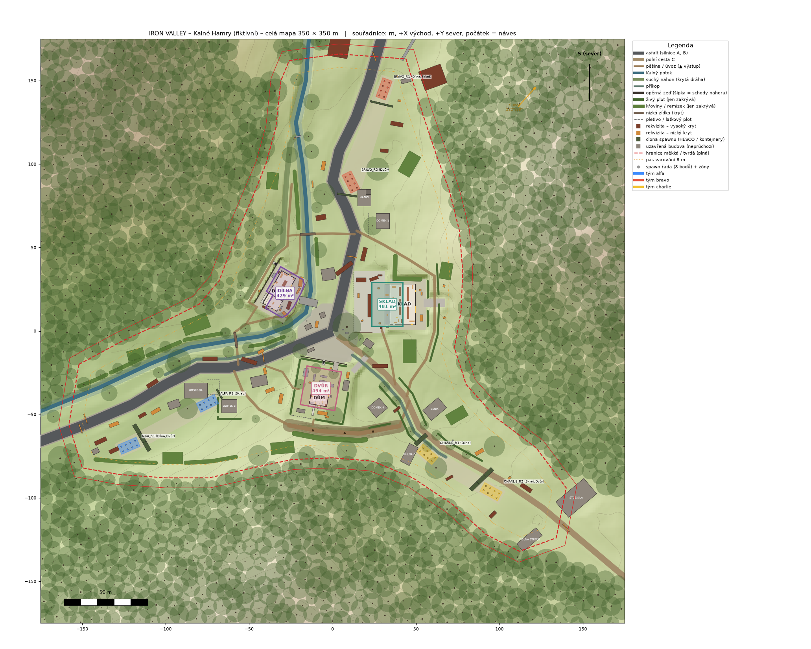
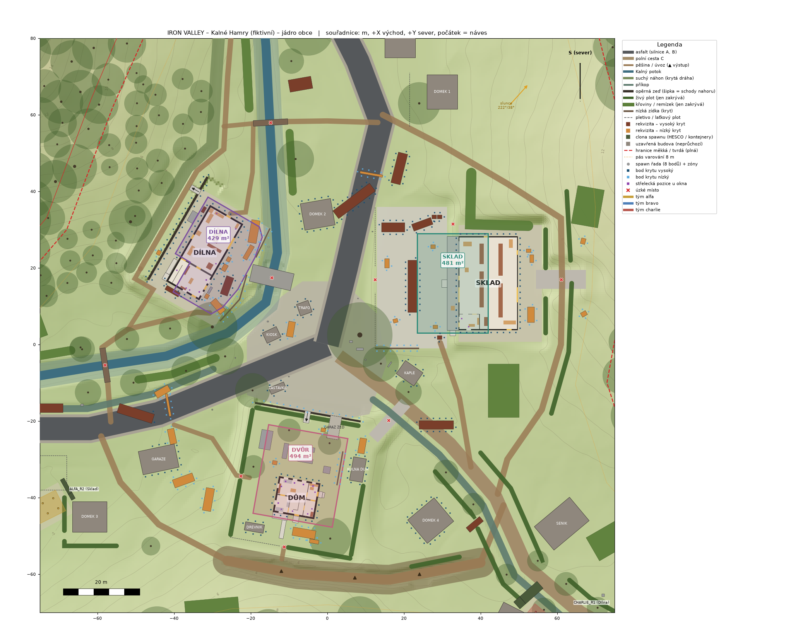
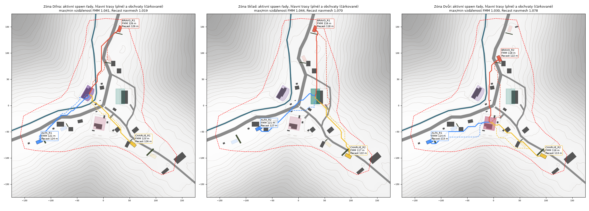

# IRON VALLEY – návrh mapy „Kalné Hamry“

Stav: **finální návrh, závazný** pro tvůrce assetů, programátory a QA. Datum: 2026-09-27 (revize podle referencí uživatele).
Data: `Shared/level/layout.json` (mapa), `Shared/level/buildings.json` (hlavní budovy),
`Shared/level/terrain_ref_0p5m.png` (referenční výšková mapa). Výtvarný směr: `Docs/ART_DIRECTION.md`.
Reference uživatele: `Docs/navrhy/`, rozbor `Docs/REFERENCE_ANALYSIS.md`, rozhodnutí `Docs/REFERENCE_DECISIONS.md`.
Výkresy: `Docs/img/` (generuje je `Tools/level/draw_plans.py` z JSON, takže vždy odpovídají datům).
Kontrola: `python3 Tools/level/check_layout.py`, která při jakémkoli porušení skončí nenulovým kódem.

Obsah: 0. Revize podle referencí · 1. Schéma dat · 2. Výběr a sloučení návrhů · 3. Mapa v číslech · 4. Uspořádání a zdůvodnění · 5. Zóny ·
6. Spawny · 7. Trasy a úzká místa · 8. Výhledy · 9. Kryty · 10. Poznámky pro AI · 11. Hranice mapy ·
12. Výkonový rozpočet prohlížeče · 13. Testovací body · 14. Ověřeno / neověřeno · 15. Regenerace dat

---

## 0. Revize podle referencí uživatele a opravy z recenze r1 (2026-09-27)

Mapa byla sladěna s referencemi `Docs/navrhy/01`–`05` a R06–R17 (rozbor `Docs/REFERENCE_ANALYSIS.md`, rozhodnutí a kompromisy
`Docs/REFERENCE_DECISIONS.md`, srovnání `Docs/img/reference_vs_plan.png`) a opraveny všechny vady z
`Docs/MAP_review_r1_defects.json`. Každá třída vad má v `Tools/level/check_layout.py` vlastní automatický test:

| Vada | Oprava v generátoru | Test |
| --- | --- | --- |
| P1-EDGE | souvislý kruh bariér 0,5 m uvnitř tvrdé hranice (oplocenky, ohradníky, plot štěrkovny, zátarasy), cedule po 25 m | BND2 |
| P1-DOCK-TERRAIN | čelo rampy a její severní konec jsou terénní stupeň (`RW_SKLAD_DOCK`, `RW_SKLAD_DOCK_N`) s mezerami; schody a nájezd stojí na rovném dvoře kolmo k rampě (`foot_ground`) | L05 |
| P1-SEC-CONTACT | každá vedlejší budova na vlastní plošině se stupňovitým soklem; rekvizity s `ground_fit` | L04 |
| P1-CUT-FACE | souvislá opěrná zeď `RW_SKLAD_NE` s korunou podle terénu (svah za ní ≤ 30°), křídla zdí na koncích, boční zeď nájezdu u dílny; oprava referenční implementace terénu (zářez na řádcích vrcholů zdí) | T05 |
| P1-GUTTERS | žlaby 0,03 m pod odkapní hranou, svody od žlabu | B16 |
| P1-AI-COVER | krycí body u nábytku v budovách, ověřené střelecké pozice u oken, body hlídání schodiště | A02 |
| P2-FALLBACK-SPAWN-LOS | `spawn_selection.fallback_rows` = jen řady bez výhledu na zónu | V01 (aktivní + záložní řady) |
| P2-SPAWN-RULE-CONFLICT | jediné normativní pravidlo v `ai_navigation.spawn_selection` | – |
| P2-DVUR-DOC | popisy zóny Dvůr, balkonu a kolny opraveny | Z01 |
| P2-ZBAND-STAIR | ramena schodišť deklarována jako spojité přechody, podesty dodržují 0,30 m | Z01 (vzorkuje schody a podesty) |
| P2-WINDOW-FURNITURE | nábytek přestěhován ke plným zdem | B07 |
| P2-DOOR-SWING-STAIRS | hlavní dveře domu otevírají dovnitř; dílna jednopodlažní | B06 (výseč křídla) |
| P2-PIERS | chodba domu rozšířena, dveře posunuty | B04 (k lícům příček) |
| P2-SKLAD-OFFICE | strop kanceláře `SK_OFFICE_CEILING` | B11 (strop z geometrie) |
| P2-BRIDGE-UNDERPASS | `deck_thickness`, prostor pod deskami uzavřený česlemi | B15 |
| P2-CONSTRUCTION-DATA | ostění a parapety v datech, štítové polygony, kamna pod komíny, otevřená kolna, generativní kulisa | B07, B08 |
| P2-ACCESS-CLUTTER | sloupky přístřešku mimo osy schodů, rekvizity mimo nástupní prostory | B09, L06 |
| P2-STEEP-PATHS | pěšiny a polní cesty srovnané (≤ 18° / 11°), nájezd 22° zrušen, rovná odbočka k zadnímu dvoru | R05 |
| P2-DITCH-COVER | `DITCH_C` účinně 1,25 m (vyřezaný po silnicích), ostatní bez nároku na kryt | D01 |
| P2-REAL-TOPONYMS | Nové Kalno, Štěrkovna Kalný Vrch | C01 |
| P2-ZONE-LINE-PROPS | rekvizity posunuty, polygon Dílny zkrácen u břehu | Z02 |
| P2-CHECKER-BLIND-SPOTS | všechny testy výše; B12 už nevynechává budovy se schody, B09 kontroluje i venkovní schody | – |

Poznámka: skript porotce `critic_r1_checks.py` zmiňovaný v recenzi v repozitáři není, jeho kontroly jsou přepsané do
`check_layout.py`.

## 1. Schéma dat

### 1.1 Konvence (platí pro oba soubory)

- **Souřadnice:** svět Blenderu, metry, **Z nahoru, +X východ, +Y sever**, počátek = střed mapy (střed návsi). Rozsah mapy
  je x, y ∈ [−175, 175]. Všechna `z` v `layout.json` jsou absolutní metry.
- **Rotace:** stupně kolem +Z proti směru hodinových ručiček (při pohledu shora). Rotace 0 znamená, že lokální +Y objektu
  (průčelí budovy) míří na sever. Kompasové azimuty (slunce, „front_faces_compass_deg“, bearing spawnů) se počítají od
  severu po směru hodin a u polí to vždy stojí v názvu.
- **Převody os** (`meta.axis_conversions`): three.js `(x, y, z)_three = (x, z, −y)_blender`, yaw se nemění. Unreal (cm)
  `(100x, −100y, 100z)`, `yaw_UE = −yaw`. Recast/Detour používá stejné osy jako three.js.
- **Postava** (`meta.character`, zdroj `Web/src/data/movement.json`): kapsle r 0,35 m, výška 1,80 m (v dřepu 1,20 m), oči
  1,65 m, krok 0,40 m, max. sklon 45°.
- **Identifikátory** zón a týmů odpovídají `Shared/config/rules.json`: `zone_dilna`, `zone_sklad`, `zone_dvur` a týmy
  `alfa`, `bravo`, `charlie`.
- Poznámky (`note`, `role`, `desc`) jsou anglicky pro generátory. Texty pro hráče jsou česky v `*_cs` a v
  `boundary.player_text_cs`.

### 1.2 `layout.json` (`"schema": "ironvalley.layout/1"`)

| Klíč | Typ | Obsah |
| --- | --- | --- |
| `schema`, `meta` | str, obj | verze schématu. `meta`: jméno, `extent`, jednotky, souřadnice, `axis_conversions`, `character`, `rules_ref`, `design_docs`, `round_fiction` (briefing a proč se zóna stěhuje), `collision_semantics` (tabulka: pohyb / střely / výhled hráče / výhled AI / kolizní proxy pro každou třídu prvků) |
| `terrain` | obj | **kontrakt terénu**, viz 1.3 |
| `water` | [obj] | `BROOK_WATER`: `polyline` [x, y, z hladiny], `width_at_surface` 2,35, `depth` 0,25, `gameplay` (chůze ×0,75) |
| `roads` | [obj] | `ROAD_A`, `ROAD_B`: `polyline` [x, y, z], `width` 6,0, `shoulders`, `surface` asphalt, `leads_to` |
| `tracks` | [obj] | `TRACK_C` (polní cesta 3,6 m), příjezd k domu a rampy: `polyline`, `width`, `surface`, `detail` |
| `paths` | [obj] | pěšiny: `xy` [x, y], `width`, `surface`, `role` (okruhy a obchvaty) |
| `ditches` | [obj] | příkopy a suchý náhon: `polyline`, `bed_width`, `depth` (účinná hloubka), `cut_depth_m`, `effective_depth_m`, `bank_slope_h_per_v`, `culverts` (každé křížení s cestou = propustek), **`crouch_cover`** (true jen při hloubce ≥ 1,25 m), `gameplay` |
| `bridges` | [obj] | `ends` [[x, y], [x, y]], `width`, `deck_z` [z0, z1], **`deck_thickness`**, `approach`, `railing` {height, type, blocks_*}, **`underpass`** {treatment closed, by, passes} (prostor pod deskou < 2,10 m je uzavřený česlemi), `role` |
| `retaining_walls` | [obj] | `polyline`, `segments` (mezery pro schody a nájezdy), `thickness`, `top_z` (+ `top_z_profile` u zdí, jejichž koruna sleduje terén), `bottom_z` (+ `bottom_z_profile`), `height_range_m`, `low_side`, `material`, `cap`, `parapet`, `guard` (zábradlí), `stairs` [{id, risers, riser, tread, width, bottom_center_world, top_center_world, …}], **`wing_walls`** [{id, polyline, thickness, top}] (křídla na koncích zdí) |
| `fences_walls_hedges` | [obj] | `type` (chain_link_on_plinth_1p5m R14, concrete_wall_chain_link, garden_wall_rendered_1p8, concrete_low_wall(_rendered), timber_picket_1m, post_and_pipe_rail_1m R16, hedge_privet, hedge_hornbeam, hedgerow_mixed), `polyline`, `height`, **`solid_height`** (plná část; pletivo nad ní je průhledné), `blocks_movement`/`blocks_bullets`/`blocks_vision`, `cover`, `traversal`, `gates`, `reference` |
| `vegetation_blocks` | [obj] | `shrub_belt`/`windbreak_belt` (`polyline`, `width`) a `shrub_copse` (`polygon`); `height`, `species_mix`, `density` (husté k zemi), `blocks_*` (pohyb a výhled ano, střely ne) |
| `buildings` | [obj] | hlavní budovy: `id`, `type`, `position` [x, y, z podlahy L0], `rotation_deg`, `footprint` [šířka X, hloubka Y], `enterable: true`, `levels`, `zone`, `pad`, `front_faces_compass_deg`, `footprint_world`. Geometrie je v `buildings.json` |
| `secondary_buildings` | [obj] | vedlejší budovy: `type` (např. `shed_r05` = kůlna podle ref. 05, `chapel` s `tower`, `bus_shelter_timber` R06, `transformer_pole_h`), `name`, `position` [x, y, z plošiny], `rotation_deg`, `footprint`, `eave_height`, `roof`, `ridge_height`, **`enterable: false`**, `reads_closed_by` (jak se čtou zavřené, žádné falešné dveře), **`plinth`** {top_z, bottom_z, visible_height(_range), ground = pad stamp}, `open_side`/`collision_proxy` (otevřené kolny), `reference`, `footprint_world` |
| `prop_catalog` | {typ: obj} | `size` [x, y, z] v m, `cover` none/low/high, případně `blocks_bullets`/`blocks_vision` (dřevo průstřelné), `module_length`, `reference`, `note` |
| `props` | [obj] | instance: `id`, `type` (klíč katalogu), `position` [x, y, z paty], `rotation_deg`, `size`, `cover`, `blocks_bullets`, `blocks_vision`, `cluster`, **`ground_fit`** {mode flat / tilt (pitch_deg, roll_deg) / conform / upright_footing, corner_z}, `note` |
| `utility_lines` | obj | dřevěné sloupy vedení R07 (`poles` [{id, pos, height, crossarm, lamp, collision_radius}]), `spans` (vodiče s průvěsem), přípojky |
| `fields`, `ground_cover` | [obj], obj | pole a louky bez kolize (`crop`, `polygon`); podrost R09/R13/R17 (`types` s výškou a vlivem na výhled, hustoty a pravidla rozmístění) |
| `capture_zones` | [obj] | `id`, `name`, `desc`, `polygon` [x, y], `center`, **`z_min`, `z_max`**, `area_m2`, `hud_marker` [x, y, z], `excluded`, `inclusion_test`, `marker` {in_world, hud} |
| `spawn_areas` | [obj] | pro každý tým: `polygon` (shromaždiště), `rows` [{row_id, s, center, zones, polygon}], `candidate_points` [{id, pos [x, y, z], yaw_deg, row, zones, rank}], `selection_rule` |
| `spawn_spines`, `zone_spawn_rows` | obj | osa spawnů podél silnice týmu (`s` = metry od návsi); která řada patří ke které zóně |
| `boundary` | obj | `soft_polygon`, `warning_polygon` (pás 8 m), `hard_polygon` (6 m za měkkou hranicí), `soft_area_m2`, `rules`, `player_text_cs`, `treatment` [{section, physical, explanation}], **`barriers`** [{id, type (deer_fence_2m, pasture_fence_barbed_1p3m, farm_fence_timber_1p4m, quarry_fence_2m, roadblock), polyline, height, construction, blocks_*, signs [{pos, text_id}]}] – souvislý kruh 0,5 m uvnitř tvrdé hranice, `barrier_rule` |
| `environment` | obj | kopie `Web/src/data/environment.json` (slunce, obloha, mraky, expozice) + mlha mapy `fog.map_override_D9` + pravidla post-processingu |
| `trees` | obj | `species` (listnaté druhy + smrk a borovice R11 pro les a okraj, `leaf_type`), `placement_rules` (jehličnany uvnitř ≤ 12 %), `counts`, `instances` [{id, species, pos, scale, yaw_deg, group}] |
| `surfaces` | obj | povrchy pro kroky a zásahy: `footstep_and_impact_types`, `regions` [{surface, priority, from}], `resolution_rule` |
| `balance` | obj | metoda FMM, `run_speed_mps`, pro každou zónu `rows_s`, `distances_center_m`, `distances_edge_m`, odchylky, `run_time_s_edge`, `primary_lanes`, `flank_lanes` |
| `lanes` | obj | `{zone: {primary: {team: [[x, y, z]]}, flank: {team: {desc, length_m, extra_vs_primary_pct, via, waypoints, deep_flank?}}}}` |
| `cover_points` | obj | `rule`, `points` [{id, pos, facing [x, y], facing_deg, height low/high/window, peek left/right/over, capacity 1, kind object / interior_object / window / stair_watch, object, building?, level?, room?, local?, sill?, zones, inside_zone}], `dropped_windows_and_stairs` (okna bez platné pozice a proč) |
| `chokepoints` | [obj] | `id`, `at` (bod nebo úsečka), `width`, `type`, `zone`, `note` |
| `ai_navigation` | obj | `agent` (+ nastavení Recastu), `rules`, `areas` (ceny), `perception`, `doors` (politika a `list` všech dveří), `offmesh_links`, `cover`, `stuck_recovery`, `hold_points`, `hold_room_state`, `lane_usage`, `spawn_selection` |
| `performance_budget_browser` | obj | rozpočet draw callů, trojúhelníků, stromů, textur, VRAM a CPU, `culling` (NOT TESTED, dokud se neměří) |
| `qa_points` | [obj] | testovací body: `id`, `kind` (zone, zone_edge, zone_z, spawn_row, spawn_point, doorway, stair, chokepoint, boundary), `pos` [x, y, z], `note` |
| `drainage` | obj | odvodnění (ENV-01): příkopy, vpusti, propustky, opěrné zdi, budovy, suchý náhon |
| `navmesh_validation` | obj | výsledek bake Recastu: `config`, `input`, `tiles`, `polys`, `entrances_checked`, `disconnected_entrances`, `balance`, `level_hash` (hash dat úrovně; nesouhlasí-li, je bake zastaralý), `status` |

### 1.3 Kontrakt terénu (`terrain`)

Výška v bodě (x, y) se počítá takto (referenční implementace: `Tools/level/lib/ivterrain.py`, funkce `heightfield`,
`height_at`):

1. **`base_grid`**: 71 × 71 výšek po 5 m (`heights[j][i]`, řádek j → y = −175 + 5j, sloupec i → x = −175 + 5i),
   interpolace Catmull-Rom bikubicky, na okraji přichycená. `base_formula_doc` jen dokumentuje, jak mřížka vznikla.
2. **`detail_noise`**: gradientní Perlinův šum fBm v 6 oktávách (vlnová délka / amplituda / seed: 64/1,25/101, 32/0,75/102,
   16/0,38/103, 8/0,15/104, 4/0,06/105, 2/0,02/106). Hash je `lowbias32`, násobení mod 2³² (JS `Math.imul`, `>>> 0`) a
   quintic fade. Maska `mask` = 0 na „tichých“ plochách (pady, silnice, zóny, spawny, budovy) s náběhem 8 m (smoothstep).
3. **`stamps`**: aplikují se **přesně v pořadí seznamu**. Druhy: `pad` (rovina z s náběhem `blend`), `road` (podélný profil
   z polyline, šířka + krajnice + náběh), `ditch` a `channel` (koryto: dno `bed_width`, svahy `bank_slope_h_per_v`,
   u potoka svislé úseky), `sunken_lane` (úvoz s `exits` [{s0, s1, side, bank_slope_h_per_v, taper}]), `wall` (výškový
   skok opěrné zdi: `high_side`, `set_high`/`set_low`, `blend_*`).
4. **`vertical_steps`**: u každé opěrné zdi a svislého úseku koryta jsou uvedeny obě lícové polyline (`high_face`,
   `low_face`). Generátor je musí vložit jako **omezující hrany triangulace** (vrcholy nejvýš po 1 m) a trojúhelníky mezi líci
   vypustit. Terén se tak nikdy nezubí (sawtooth).
5. **`reference_bake`**: `terrain_ref_0p5m.png`, 16bitová šedá mapa 701 × 701 po 0,5 m, z = z_min + v/65535 · (z_max − z_min),
   řádek 0 = sever. **Výstup generátoru musí souhlasit do 0,02 m** (kromě pásma 0,5 m u svislých líců). Shodu referenční
   implementace s bakem ověřuje kontrola T04 (0,4 mm).
6. `backdrop`: prstenec vzdálených kopců (poloměr 260–2400 m, hřebeny 60–180 m, les) s generativní specifikací (profil hřebene
   po 10°, seed). Údolí A se otevírá k ZJZ, kde je vidět věž kostela fiktivního Nového Kalna.

### 1.4 `buildings.json` (`"schema": "ironvalley.buildings/1"`)

Úplné konvence jsou v poli `conventions` souboru. Shrnutí:

- **Lokální rámec budovy:** metry, Z nahoru, počátek = střed vnějšího půdorysu (vnější líce obvodových zdí) na úrovni hotové
  podlahy přízemí. Lokální +Y = průčelí. Na svět se převádí rotací o `rotation_deg` z `layout.json` a posunem o `position`.
- **Záznam budovy:** `id`, `type`, `name`, `enterable`, `story` (proč tu stojí), `local_origin`, `footprint_external`,
  `footprint_parts` [{part, external_rect, interior_rect, walls, check}], `structure`, `levels` [{id, name, floor_z,
  ceiling_height, floor_thickness, extent?}], `rooms` [{id, level, name, polygon, ceiling_height, floor_material, in_zone}],
  `sealed_voids`, `walls`, `openings`, `columns`, `slabs`, `stairs`, `exterior_stairs`, `balustrades`, `balconies`, `roof`,
  `gutters`, `downpipes`, `drainage`, `foundation`, `loading_dock`, `exterior_steps`, `chimneys`, `furniture`, `zone_notes`.
- **Zeď** je kvádr: osa `start` → `end` (přesné konce), `thickness` symetricky kolem osy, výška od `base_z` do `base_z + height`
  nad podlahou podlaží. Zdi ve směru X probíhají přes rohy, zdi ve směru Y končí na vnitřních lících, kvádry se nepřekrývají.
  Obvodové zdi jsou vedené proti směru hodin, takže levá normála míří dovnitř (`finish_left` = vnitřní povrch).
  **`construction_boxes`** (pilíře, parapety, nadpraží) jsou závazné pro generátor a nahrazují booleovské operace.
- **Otvor:** `offset_from_start`, `width`, `sill_height` a `head_height` popisují **hrubý stavební otvor**. U dveří se odečítá
  zárubeň 0,05 m (každý bok i nadpraží) a tloušťka křídla: **`clear_width` a `clear_height` jsou uvedeny u každých dveří**
  i s pravidlem výpočtu (`clear_rule`). Projektové pravidlo je světlost ≥ 1,10 × 2,05 m (zadání ≥ 0,90). `passes` {movement,
  bullets, vision}: okno je rovina blokující kapsli a propouštějící střely a výhled, žaluzie blokuje vše. Křídlo stojí
  v klidové poloze `open_deg`. **Posuvná vrata** (`sliding_door`, sklad): vodítka 0,05 m, `state.open`, `leaf_rest` (poloha
  zaparkovaného křídla přes plnou zeď, 0,25 m od líce, mimo pilastry); zavřená vrata jsou zeď. Okna mají `reveal_depth` 0,12
  a `sill_overhang` 0,04.
- **Štíty:** zeď, nad jejíž korunou jsou otvory, má `gable` {roof, polygon_uz, apex_z, openings, construction_polygons} –
  štít je rozřezaný na polygony bez děr (žádné booleovské operace).
- **Střechy a odvodnění:** `roof[]` (gable / hip s `abuts` / mono, `eave_z` = výška na líci zdi, `overhang_eave`,
  `supports` u přístřešků), `gutters[]` {roof, edge, from, to, `drip_edge_z` = eave_z − přesah × tg sklonu, z = 0,03 m pod ní},
  `downpipes[]` {pos, top_z = z žlabu, outlet}, `chimneys[]` {pos, size, `base_z`, top_z, `serves` = kamna/výheň}, `pilasters`,
  `fixtures` (lampy, nápisy).
- **Schodiště:** `start` = střed hrany prvního (spodního) stupně, **`direction_deg` = směr výstupu od lokální +Y proti
  směru hodin** (0 = +Y, 90 = −X, 180 = −Y, 270 = +X), `direction_vector` = (−sin, cos), `count` stupňů, `treads` = count − 1,
  `run`, `rise`, `riser`, `tread`, `two_r_plus_t`, `width` (světlá), `waist`, `top_riser_center` (kontroluje se jako start +
  směr × run), `landing`, **`under_stair`** {treatment: enclosed / solid_mass / filled, …}. Pod každým ramenem a podestou, kde je
  výška pod 2,10 m, je plná kolize.

---

## 2. Výběr a sloučení návrhů

> Historický záznam výběru (2026-09-26). Po revizi podle referencí uživatele (2026-09-27) platí pro dílnu, sklad, dům, kůlny,
> zídky, okraj mapy a vegetaci oddíly 4–11 a `Docs/REFERENCE_DECISIONS.md`; tabulky níže popisují, jak návrh vznikl
> (např. kancelář v patře dílny a jehličnany už neplatí).

Hodnotily se tři návrhy dvěma porotci (součet bodů): **„combat“ – Kalné Hamry 82,0** (42,5 + 39,5), „place“ – Kladivná 79,5
(39,5 + 40), „systems“ – Hamrovec 76,5 (37 + 39,5). **Základem je „combat“**: Y-údolí se třemi rameny, tři zóny mezi rameny
asi 32 m od návsi, vzorec „dva blízké týmy a jeden vzdálený“, kompaktní hrací plocha 42 442 m² a nejkratší běhy.

### 2.1 Převzaté nápady

| Z návrhu | Nápad | Kde je v datech |
| --- | --- | --- |
| place | příběh a zdůvodnění každého umístění: hamr na suchém náhonu od jezu, sklad na 1 m protipovodňovém násypu (proto podlaha v 1,10 m a rampa), dům na pískovcové terase se zapuštěnou garáží a zahradními schody | `buildings[].story`, `S_GARAZ_ZED`, `RW_DUM`, `MILLRACE`, katalog `weir_stone_low`, `sluice_gate_frame` |
| place | odvodnění každé plochy: svody do vpustí a chrličů, silniční příkopy, propustky, odvodňovací otvory zdí | `drainage`, `buildings[].downpipes`, `buildings[].drainage` |
| place | **úvoz** (1,8 m hluboký, výstup nejvýš každých 19 m) a náhonová terasa jako kryté obchvaty **mimo zóny** | stamp `UVOZ_S`, `P_S_RING`, `P_MILLRACE`, terasa za `RW_DILNA` |
| place | skóre rizika spawnu (−10 LOS, −5 za nepřítele do 45 m, +1 za spojence do 30 m, seed Mulberry32), `door_link` vypnutý na 20 s při zablokovaném křídle > 2,5 s, pás varování 8 m, odpočet a smrt „Minové pole“ bez připsání zabití, `under_stair` u každého schodiště | `ai_navigation.spawn_selection`, `ai_navigation.doors`, `boundary.rules`, `stairs[].under_stair` |
| systems | tabulka pohyb / střely / výhled / výhled AI a kolizní proxy pro každou třídu prvků | `meta.collision_semantics` |
| systems | krycí body s `facing_deg`, `capacity` 1, `peek`, střelecké pozice u oken (i vnitřních oken kanceláře), rezervace dveří (1 agent na 1,2 s, přeplánování po 2 s, boti dveře nezavírají, kinematická křídla), vnímání AI do 150 m (plně do 60 m), žádné průlezy jen v dřepu, seznam úzkých míst se šířkami | `cover_points`, `ai_navigation`, `chokepoints` |
| systems | stavební gramatika bez booleovských operací (pilíře, parapety, nadpraží, instancované rámy, schody jako rampa + stupňovitý mesh), převody os three.js a UE | `construction_boxes`, `conventions`, `meta.axis_conversions` |
| systems | značka zóny v prostředí (signální kouř, bedna s převaděčem, čára na zemi) a příběh kola (shoz zásob, kordon) | `capture_zones[].marker`, `meta.round_fiction` |
| systems | vnitřní okna kanceláře dílny do haly (kancelář mimo zónu, dva východy), balkon domu s plným parapetem 1,0 m mimo zónu | `DL_WI1`, `DL_WI2`, `DL_ES1`, balkon domu |
| systems | **pevné clony spawnů** (HESCO, kontejnery), aby bezpečnost spawnů nestála na listí | `props` `P_SCREEN_*`, katalog `hesco_line`, `container_stack_2`, `container_stack_2_10ft` |

### 2.2 Povinné opravy (must-fix) a jejich řešení

| Požadavek porotců | Řešení | Ověření |
| --- | --- | --- |
| `direction_deg` schodišť v konvenci 0 = lokální +Y proti směru hodin, zdokumentovat, kontrolovat `top_riser_center` | celý generátor budov přepsán na tuto konvenci, popsáno v `conventions` | B09 (mutační test: stará konvence 0 = +X vyvolá FAIL) |
| dveře DL_D6 (0,95) a DL_D9 (0,90) aspoň 1,00; u všech dveří explicitní světlost se srážkou zárubně | všechny průchozí dveře mají světlost **1,10 × 2,25 m** (vrata dílny 3,18 × 3,55, rolovací vrata skladu 3,90 × 4,15 a 3,90 × 2,55) a pole `clear_width`, `clear_height`, `clear_rule` | B05 (mutant se světlostí 0,90 selže) |
| bake Recast navmeshe při buildu a bilance na něm (≤ 1,06), build selže při odpojeném vstupu | `Tools/level/nav` (recast-navigation 0.43.1 v Node, WASM jen v build nástroji, D4): **cs 0,05 m, r 7 buněk = 0,35 m**. Při cs 0,10 / r 4 se zúžilo U-schodiště domu, proto rozhodnutí D10 | N01: 83/83 vstupů připojeno, poměr 1,034 / 1,036 / 1,046 |
| patra, galerie a vyvýšené místnosti s jedním přístupem mimo zóny; příkopy a koryta mimo zóny přes z_min; dva východy z každé vyvýšené místnosti; test hranice z | kancelář dílny (podlaha z 4,30 > z_max 3,80) i patro a balkon domu (z 5,94 > 5,54) leží mimo zóny. Každá plocha uvnitř polygonu leží ≥ 0,30 m uvnitř nebo vně pásma z. Kancelář má vnitřní a venkovní schodiště, patro domu U-schodiště a balkonové schody. Testovací body `zone_z` | Z01, B13b, Q01 |
| spawny kompaktní (≤ 25 m), ≥ 10 m uvnitř měkké hranice, týmy ≥ 150 m od sebe, směry příchodu ≥ 80°, `minEnemyDistance` na předních řadách | řady 2 × 4 bodů (rozpětí 9,5 m), ≥ 13,9 m od hranice, nejmenší rozestup týmů 169 m, směry ≥ 88°. Tvrdé pravidlo 25 m a skóre rizika v `spawn_selection` | S01, S02 |
| uzavřít každý prostor pod schody s výškou pod 2,10 m, kontrolovat ve 3D | `under_stair` + `sealed_voids`, podstupňové stěny, plná hmota, zaplnění dřevem | B14 (mutant bez stěny pod schody selže) |
| LOS včetně oken a pater, spawn → zóna = 0, keře jako husté proxy, dlouhé koridory | 3D LOS model (orientované kvádry ze `construction_boxes` s otvory, střechy, props, HESCO), cíle i okna a balkony v patrech. **0 paprsků** jen s pevnou geometrií. Vnímání AI do 150 m + mlha D9 | V01, oddíl 8 |
| rozhodnout o hlubokém obchvatu Brava ke skladu (+24,8 %) a ověřit obchvaty ≤ 10 % | ponechán a zdokumentován jako záměrný hluboký obchvat (+23,1 %), ostatní obchvaty ≤ 9,8 % | R01 |
| rozpočet prohlížeče (≤ 450 draw callů, ≤ 2 M trojúhelníků), stromy jako impostory, PERF-01 měřit | 426 draw callů, 1 924 000 trojúhelníků, 1124 z 1626 stromů jen impostor. PERF-01 = **NOT TESTED** | P01 |
| nezávislé kontroly porotců | `judge_runs/geo_final.py` (vlastní FMM raster porotce): 1,03 / 1,037 / 1,035; `spawns_final.py`: rozestupy ≥ 169 m, směry ≥ 88° | spuštěno |
| (porota 2) menší hrací plocha 45–55 tis. m² | 42 442 m² (základ „combat“) | BND |
| bezpečnost spawnů jen s pevnou geometrií, koruny stromů nejsou neprůhledné | clony HESCO 2,74 m / kontejnery 5,18 m, vždy celé moduly (HESCO po 1,07 m, kontejner 20 ft nebo 10 ft) | V01 |
| tvarované zóny 450–550 m² místo kruhů | polygony 429 / 481 / 494 m² sledující budovy a dvory | Z01 |
| dveře na trasách botů ≥ 1,10, nebo bake cs 0,05; koridor ≥ 0,30 m s křídly v klidové poloze | obojí: 1,10 m **a** cs 0,05 / r 7, koridor ≥ 0,40 m | B05, N01 |
| konektivita kapsle na každém podlaží včetně nástupů na schody (zářez 0,70 m u DL_S1) | schodiště dílny přestavěno (nástupní záliv 1,20 m, podstupňová stěna místo plné příčky). Rastr kapsle po 5 cm na každém podlaží | B13c, R04, N01 |
| gradientní šum s referenční implementací místo sinusovek, žádný „blob“ terén | `detail_noise` (6 oktáv), maska na pady a cesty, reliéf RMS 0,36 m | T01, T03 |
| svislé skoky terénu bez zubů | `vertical_steps` s oběma líci jako omezujícími hranami | T02 |
| každý stupeň 0,16–0,19 a 2R+T 0,60–0,65, krátké lávky | všechny stupně včetně venkovních (B10). Lávky mají 9 m a most 11 m, oba konce v úrovni břehu bez schodů | B09, B10 |
| identifikátory z `rules.json` | `zone_dilna/zone_sklad/zone_dvur` („Dvůr“), `alfa/bravo/charlie` | C00 |
| žádné KTX2/Basis (D3) | DDS BC + JPEG/PNG | P01, `ART_DIRECTION.md` 3.5 |
| jedna pravda o světle | slunce 222°/38° z `environment.json` (odpovídá 10. 9. 2026 15:05). Mlha mapy jako rozhodnutí D9 | `environment` |
| dokumentace odpovídá datům | výkresy i tabulky v tomto dokumentu se generují z JSON, testovací body kontroluje Q02 | Q02 |
| jedna čitelná identita spawnu na tým, aktivní spawny a hranice na mapě před kolem | Alfa = pila u hostince (rameno A), Bravo = štěrkovna (rameno B), Charlie = statek (rameno C). `boundary.rules.map` | – |
| listnaté stromy v hrací ploše, keře-okludory husté k zemi | 14 listnatých druhů, žádný jehličnan (ani túje v plotech), `density` u keřů | G01 |

---

## 3. Mapa v číslech

| Údaj | Hodnota |
| --- | --- |
| rozsah dat | 350 × 350 m (x, y ∈ [−175, 175]) |
| hrací plocha (měkká hranice) | **42 442 m²** |
| zóny | Dílna 429 m², Sklad 481 m², Dvůr 494 m² |
| cesta ze spawnu k okraji zóny | 113–125 m (FMM), 116–127 m (Recast), běh 3,5 m/s **32–36 s**, sprint ~20–22 s |
| bilance (nejdelší/nejkratší) | FMM (kontrola S03) 1,030 / 1,044 / 1,047; Recast 1,034 / 1,036 / 1,046 |
| rozestup aktivních spawnů různých týmů | ≥ 169 m; směry příchodu k zóně ≥ 88° |
| budovy | 3 hlavní (všechny plně průchozí, dílna a dům dvoupodlažní) + 21 vedlejších (neprůchozí) |
| rekvizity / stromy / krycí body / úzká místa / testovací body | 103 / 1626 / 593 / 57 / 186 (oddíl 13) |

---

## 4. Uspořádání a zdůvodnění





**Kalné Hamry** leží na soutoku tří údolí ve tvaru Y. Náves s památnou lípou je v počátku souřadnic. Kalný potok obtéká náves
ze severu na západ a teče k ZJZ.

- **Rameno A (ZJZ):** asfaltová silnice A do (fiktivního) Nového Kalna. Na jejím konci je zátaras Alfy a pila za
  hostincem. Týmová identita **Alfa**: dřevo, klády, bouda pily.
- **Rameno B (S):** asfaltová silnice B ke štěrkovně Kalný Vrch. Na konci jsou haldy štěrku, dopravník, kontejner kanceláře
  a zátaras Brava. Identita **Bravo**: štěrk a těžká technika.
- **Rameno C (JV):** polní cesta C se stromořadím ke statku (stodola, kolna na stroje, seník). Identita **Charlie**: pole,
  balíky, traktor.

**Tři zóny leží mezi rameny**, vždy na úpatí ostrohu asi 32 m od návsi. Každou zónu mají dva týmy „blízko“ (střetnou se
první) a třetí tým přichází „zdaleka“ přes náves do jejich boku. Každý tým je vzdálený právě jednou:

| Zóna | Mezi rameny | Blízké týmy | Vzdálený tým (přední řada) |
| --- | --- | --- | --- |
| Dílna | A a B | Alfa, Bravo | Charlie (řada s = 89 m) |
| Sklad | B a C | Bravo, Charlie | Alfa (řada s = 85 m) |
| Dvůr | C a A | Charlie, Alfa | Bravo (řada s = 92 m) |

Proč právě takto:

- **Hamr** potřeboval vodu, proto dílna (jednopodlažní hala s přístavkem a kůlnou podle ref. 04) stojí u potoka a za ní vede
  **suchý náhon** od jezu pod štěrkovnou (vodu přestal vést v roce 1952). Náhon leží na terase, kterou drží opěrná zeď
  z lomové droby `RW_DILNA` (2,1 m) se schody; na JZ konci je travnatý nájezd se zděnou boční zdí `RW_DILNA_RAMP`.
- **Sklad JZD** (dlouhá cihlová hala se zelenou vlnitou střechou, ref. 01/03) stojí na plošině zaříznuté do svahu; dvůr
  u silnice je protipovodňový násyp o 1,10 m níž (výška korby), proto nakládací rampa se dvěma schody a nájezdem. Plošinu
  drží opěrná zeď `RW_SKLAD_NE` (koruna sleduje terén, zábradlí), čelo rampy a její severní konec jsou terénní stupeň.
  Na zadní dvůr vede po rovině odbočka `TRACK_SKLAD_REAR` z východní polní cesty.
- **Dům mistra** (dvoupodlažní, červená tašková valba, přízemní křídlo, ref. 01) stojí na slunné terase nad návsí v zahradě
  obehnané zdí. Terasu drží kamenná zeď `RW_DUM` s omítnutou zahradní zdí 1,0 m nahoře, se zapuštěnou garáží a zahradními
  schody. Na dvůr za domem vede příjezd od cesty C.
- Obec kolem je hustá (hostinec, hasičská zbrojnice se sušicí věží, řadové garáže, kaplička, trafostanice, zastávka,
  stánek, čtyři chalupy, kůlny), takže jádro působí jako malá průmyslová vesnice, ne jako samota.
- **Okruhy za zónami** spojují ramena: SZ náhonová pěšina (A↔B za dílnou), východní okruh podél meze (B↔C za skladem)
  a jižní okruh úvozem (C↔A za domem).
- **Výhledy tlumí věrohodné překážky**: zavřené chalupy, vypálený autobus a nákladní vrak jako zátarasy na silnicích,
  traktor s vlekem na cestě C, břehové pásy keřů, polní remízky, větrolam u skladu, mez s javory na hraně úvozu a živé ploty
  domu.

---

## 5. Zóny

Pravidla: kontrolu získá tým s jednoznačně nejvíce živými členy v zóně (`Shared/config/rules.json`). Postava se počítá,
když **pata kapsle (x, y, z_paty) leží uvnitř polygonu a z_min ≤ z_paty ≤ z_max**. Každá pochozí plocha uvnitř polygonu
leží nejméně 0,30 m uvnitř nebo vně pásma z, takže o zařazení nerozhoduje zaokrouhlení. Patra, galerie a balkony jsou
**vždy mimo zónu**.

Značka v prostředí (jen u aktivní zóny): **fialový signální kouř** a olivová bedna s převaděčem v `hud_marker`, bílá čára
0,12 m po obvodu polygonu. HUD zobrazuje obrys a vzdálenost a barví se barvou týmu, který zónu drží. Sporná zóna je bílá, prázdná šedá (stejně jako `Web/src/game/zoneView.js`).
Týmové barvy (modrá, červená, žlutá) jsou vyhrazeny vlastnictví.

| Zóna | Plocha / pásmo z | Co se počítá | Co se nepočítá | Charakter boje | Krycí body uvnitř |
| --- | --- | --- | --- | --- | --- |
| **Dílna** `zone_dilna` | ZONE_DL_AREA m², z 0,70–3,80 | celá jednopodlažní dílna (hala, výdejna, šatna, kompresorovna v kůlně) a dvůr mezi halou a potokem | náhonová terasa za opěrnou zdí (z 3,13), svah břehu a koryto potoka, deska mostu | CQB v hale (výheň, soustruhy, regály, pracovní stoly) + dvůr s hromadami materiálu, VZV a přívěsem; dvoje vrata (3,40 a 2,60 m), zadní dveře, dvoje štítové dveře, dveře přístavku a kůlny | ZONE_DL_CP |
| **Sklad** `zone_sklad` | ZONE_SK_AREA m², z 0,80–5,00 | nakládací rampa se schody a nájezdem, přední ulička, kancelář a první řada regálů, předpolí rampy ve dvoře | zadní ulička a druhá řada regálů, zadní dvůr, zástěry u štítů dál než 0,5 m | střední vzdálenost podél rampy (výškový rozdíl 1,10 m, jednosměrný seskok nebo vyšplhání 0,5–1,3 m), regály jako kryt; posuvná vrata: vpředu jedna otevřená a jedna zavřená, vzadu otevřená | ZONE_SK_CP |
| **Dvůr** `zone_dvur` | ZONE_DV_AREA m², z 1,90–5,54 | zděná zahrada na terase, přízemí domu včetně přízemního křídla, pás 1,25 m za domem (podesta zadních dveří) | náves pod opěrnou zdí, zadní dvůr (za pásem 1,25 m), patro a balkon domu (z 5,94); ramena schodiště jsou spojité přechody | smíšený: dům jako pevnost s mnoha vstupy, zahradní zdi 1,0 / 1,8 m, útok z návsi po schodech nebo po příjezdu | ZONE_DV_CP |

Vyvýšená pozice u zóny (mimo zónu, dva východy): jen patro domu (okna do zahrady a dvora, balkon se schodištěm do zadního
dvora). Není bezpečné: je dostupné ze dvou stran a na dohled z více směrů. Dílna je jednopodlažní.

---

## 6. Spawny

- Každý tým má **dvě řady po 8 bodech** (2 × 4, rozestup 1,5 m a více, rozpětí 9,5 m) na ose podél své silnice
  (`spawn_spines`, `s` = metry od návsi). Pro každou zónu je aktivní jedna řada (`zone_spawn_rows`). Vzdálený tým používá
  přední řadu (s 85–92 m), blízké týmy zadní (s 132–158 m).
- Body leží na pochozím terénu se sklonem do 15°, ≥ 0,85 m od objektů, ne v budovách, ≥ 10 m uvnitř měkké hranice (mimo pás
  varování; skutečné minimum je 13,9 m).
- **Clony:** před každou řadou stojí pevná clona kolmo ke směru na zónu, 3,5–4,5 m před první řadou. Konce clony zůstávají
  otevřené jako šikana. Typy: **HESCO** (2 patra gabionů, 2,74 m, celé buňky po 1,07 m) nebo **dva kontejnery na sobě**
  (5,18 m, 20 ft = 6,06 m nebo 10 ft = 2,99 m), pokud řada hledí do kopce k zóně. Výška clony se volí podle potřebné výšky
  paprsků. Výsledek: **0 viditelných paprsků** ze spawnu do zóny, do oken a na balkony pater u zóny i na nepřátelské řady,
  a to jen s pevnou geometrií (V01).
- **Výběr bodu** (`ai_navigation.spawn_selection`): na začátku kola obsadí 6 členů různé body aktivní řady, přední řady
  nejdřív. Při respawnu se každý volný bod ohodnotí: −10, pokud na něj má nepřítel přímou viditelnost (oči 1,65 m → bod
  + 1,2 m), −5 za každého nepřítele do 45 m, +1 za spojence do 30 m. Vyhrává nejvyšší skóre, shodu rozhodne seed kola
  (Mulberry32, `Shared/testvectors/rng.json`). **Tvrdé pravidlo:** nikdy do 25 m od živého nepřítele
  (`respawn.minEnemyDistance`) ani do 1,0 m od postavy. Když selže aktivní řada, použijí se jen řady z
  `spawn_selection.fallback_rows[zóna][tým]` (řady, ze kterých na zónu není vidět – V01 je testuje stejně jako aktivní řady),
  jinak respawn počká 2 s a skóruje znovu. Toto je **jediné normativní pravidlo**; `spawn_areas[].selection_rule` na ně jen
  odkazuje. Přední řady (ALFA_R2, BRAVO_R2, CHARLIE_R1) jsou nejexponovanější a pravidlo 25 m se u nich uplatní vždy.
- Mapa před kolem a mapa v pauze ukazují aktivní řadu týmu, tři zátarasy a měkkou hranici.



### 6.1 Bilance (generováno z dat)

<!-- BALANCE:BEGIN -->
**Dílna** (429 m², z 0,70–3,80 m)

| tým | spawn řada (s) | přímo ke středu / k okraji | FMM chůze k okraji | Recast cesta k okraji | běh 3,5 m/s | obchvat |
| --- | --- | ---: | ---: | ---: | ---: | --- |
| alfa | ALFA_R1 (142 m) | 130,9 / 116,2 m | 121,8 m | 122,8 m | 34,8 s | P_BANK_TERRACE ramp -> mill-race terrace -> RW stairs: 143,5 m (+4,9 %) |
| bravo | BRAVO_R1 (157 m) | 136,9 / 123,3 m | 125,4 m | 125,2 m | 35,8 s | footbridge B -> west bank -> gable door DL_D3: 140,3 m (-0,1 %) |
| charlie | CHARLIE_R1 (89 m) | 126,5 / 118,6 m | 125,7 m | 126,9 m | 35,9 s | brook bed from the square culvert (low covered lane): 136,9 m (+3,9 %) |

Poměr nejdelší/nejkratší: FMM 1,032, Recast 1,034 (cíl ≤ 1,06; zadání ±10 %).

**Sklad** (481 m², z 0,80–5,00 m)

| tým | spawn řada (s) | přímo ke středu / k okraji | FMM chůze k okraji | Recast cesta k okraji | běh 3,5 m/s | obchvat |
| --- | --- | ---: | ---: | ---: | ---: | --- |
| alfa | ALFA_R2 (84 m) | 123,7 / 108,9 m | 121,4 m | 125,9 m | 34,7 s | track C start -> warehouse yard S gate (P_SKLAD_S): 139,8 m (+1,3 %) |
| bravo | BRAVO_R1 (157 m) | 129,1 / 116,1 m | 117,8 m | 121,5 m | 33,7 s | E ring hedgerow -> field ramp -> rear yard -> RD3/D4: 164,9 m (+23,1 %, hluboký obchvat) |
| charlie | CHARLIE_R2 (132 m) | 128,0 / 112,6 m | 116,5 m | 122,5 m | 33,3 s | E ring from track C -> rear yard: 137,7 m (+3,8 %) |

Poměr nejdelší/nejkratší: FMM 1,042, Recast 1,036 (cíl ≤ 1,06; zadání ±10 %).

**Dvůr** (494 m², z 1,90–5,54 m)

| tým | spawn řada (s) | přímo ke středu / k okraji | FMM chůze k okraji | Recast cesta k okraji | běh 3,5 m/s | obchvat |
| --- | --- | ---: | ---: | ---: | ---: | --- |
| alfa | ALFA_R1 (142 m) | 121,4 / 105,6 m | 113,9 m | 115,9 m | 32,5 s | S ring path -> rear yard gate: 135,5 m (+8,6 %) |
| bravo | BRAVO_R2 (92 m) | 122,2 / 113,1 m | 117,5 m | 119,5 m | 33,6 s | square -> driveway (E) instead of the wall stairs: 139,7 m (+9,7 %) |
| charlie | CHARLIE_R2 (132 m) | 120,3 / 105,5 m | 119,3 m | 121,3 m | 34,1 s | S ring -> sunken lane (úvoz) -> north exit -> rear yard gate: 144,3 m (+9,8 %) |

Poměr nejdelší/nejkratší: FMM 1,048, Recast 1,046 (cíl ≤ 1,06; zadání ±10 %).

<!-- BALANCE:END -->

Metody: **přímo** = průměr přímých vzdáleností 8 bodů aktivní řady ke středu / k okraji polygonu. **FMM** = geodetická
vzdálenost metodou fast marching na rastru 0,25 m (pochozí plocha zúžená o poloměr kapsle, dveře, schody jako rampy,
rampa, mosty, voda × 0,75). **Recast** = délka cesty Detour po skutečném navmeshi (cs 0,05, r 0,35). **Obchvat** =
nejkratší cesta přes určený průjezdní bod, porovnaná s hlavní trasou.

---

## 7. Trasy a úzká místa

Hlavní trasy (`lanes.<zone>.primary`) jsou nejkratší cesty z aktivní řady. Obchvaty (`lanes.<zone>.flank`) vedou přes
průjezdní bod a smějí být nejvýš o 10 % delší. Jedinou výjimkou je záměrný **hluboký obchvat Brava ke skladu (+23,1 %)**
podél meze východního okruhu do zadního dvora skladu: jde o manévr do týlu. Bravo má ke skladu i běžné alternativy
(severní konec dvora, krajnice silnice B) v rámci 10 %.

| Zóna | Tým | Hlavní trasa | Obchvat |
| --- | --- | --- | --- |
| Dílna | Alfa | silnice A → lávka A → břeh → dvůr dílny | nájezd na náhonovou terasu → schody v opěrné zdi |
| Dílna | Bravo | silnice B → náves → most → dvůr | lávka B → západní břeh → štítové dveře DL_D3 |
| Dílna | Charlie | cesta C → náves → most | koryto potoka od propustku na návsi (nízká krytá dráha) |
| Sklad | Alfa | silnice A → náves → dvůr skladu | začátek cesty C → jižní branka dvora (P_SKLAD_S) |
| Sklad | Bravo | silnice B → vrata dvora | východní polní cesta → odbočka k zadnímu dvoru (JV roh, po rovině) → posuvná vrata SK_SD3 / dveře SK_D4 (hluboký) |
| Sklad | Charlie | cesta C → jižní část dvora | východní polní cesta od cesty C → odbočka → zadní dvůr |
| Dvůr | Alfa | silnice A → zahradní branka na západní hraně terasy | jižní okruh → branka zadního dvora |
| Dvůr | Bravo | silnice B → náves → schody v opěrné zdi | náves → příjezd (východ) místo schodů |
| Dvůr | Charlie | cesta C → příjezd → dvůr | jižní okruh → úvoz → severní výstup → branka zadního dvora |

Terénní prvky tras:

- **Úvoz** `UVOZ_S`: stará vozová cesta vyjetá 1,8 m do spraše jižního ostrohu. Svahy jsou strmé (55°, kořeny, nepochozí),
  konce se zvedají do terénu přes 12 m a má 3 boční výstupy (rampy 32°), takže **výstup je nejvýš každých 19 m**. Leží celý
  mimo zóny. Jižní hranu lemuje mez s keři a mladými javory (4,5 m), aby z louky na ostrohu nebyl výhled shora do zahrady domu.
- **Náhonová terasa**: pěšina podél suchého náhonu (vyhloubený 1,0 m, na svahu účinně 0,3–0,6 m – žádný zákop pro
  schovávání) na terase 2,1 m nad dvorem dílny, mimo zónu. Vstupy jsou po schodech v opěrné zdi, po nájezdu na JZ konci a od
  lávky B.
- **Příkopy:** `DITCH_C` podél cesty C je **1,25 m hluboký** (svahy 1 : 1,5, kamenité dno s pramínkem) – hráč v dřepu
  (1,20 m) je v něm krytý (`crouch_cover`, ověřuje D01). `DITCH_A` u silnice A je jen mělký odvodňovací žlab (účinně
  0,2–0,3 m, bez krytu). Každé křížení s cestou nebo pěšinou má propustek.
- **Potok**: brodit se dá všude (rychlost × 0,75, šplouchání), břehy 1 : 1,5 jsou pochozí, kromě kamenných opěr hlavního
  mostu.

Úzká místa (`chokepoints`, 57 položek se šířkou): hlavní most (4,5 m, zábradlí průhledné), lávky A a B (1,5 m), schody
v opěrných zdech (1,4 a 1,5 m), příjezd k domu (3,2 m), branky zahrady (2,2–2,4 m), vrata dvora skladu (7 m), schody
a nájezd rampy (1,5 / 2,0 / 2,8 m), odbočka k zadnímu dvoru skladu (3,0 m), výstupy z úvozu (3,5–4 m), všechny dveře
(1,10 m, vrata dílny 3,20 a 2,40 m, posuvná vrata 3,50 m) a všechna schodiště (1,1–2,0 m).

---

## 8. Výhledy

Zásady:

1. **Spawny nic nevidí** a nikdo nevidí je: 0 paprsků jen s pevnou geometrií (V01, včetně oken a balkonů v patrech).
2. **Žádná bezpečná vyvýšená pozorovatelna nad zónou.** Patra jsou mimo zóny a mají dva východy. Louka na jižním ostrohu nad
   Dvorem je clonená mezí nad úvozem.
3. **Dlouhé koridory lámou věrohodné překážky**: vrak autobusu (silnice B u návsi), nákladní vrak a zátaras (silnice A),
   traktor s vlekem (cesta C), větrolam kolem severního konce skladu (5,5 m), remízek jižně od skladu (VK_9), břehové keře
   (rameno A a západní břeh u lávky B) a zavřené chalupy.
4. Zbylé koridory svah–svah o délce 175–260 m řeší **limit vnímání AI 150 m** (plná detekce do 60 m) a mlha D9 (10 % na
   150 m). Mlha je jen vizuální a nenahrazuje geometrii.

Měření (`Tools/level/analyze_sightlines.py`): pozorovatelé na každé pochozí buňce 4 m, oči 1,65 m, cíle na pochozích buňkách
zóny po 4 m ve výšce 1,2 m. Model „jen pevná geometrie“ je pesimistický, protože nepočítá s listím. Model „+ keře“ přidává
husté vizuální proxy keřů, živých plotů a remízků. Koruny stromů se nepočítají nikdy.

<!-- SIGHTLINES:BEGIN -->
| zóna | model | plocha, odkud je vidět (m²) | nejdál (m) | > 100 m a vidí ≥ 25 % zóny (m²) | sektory útoku 20–80 m | vyvýšené pozorovatelny | okna v patře: podíl viditelné zóny |
| --- | --- | ---: | ---: | ---: | ---: | ---: | --- |
| Dílna | jen pevná geometrie | 23 808 | 198 | 2 864 | 8 / 8 | 0 | DL_W10 0 %, DL_W11 0 %, DL_W12 0 %, DL_W13 0 %, DL_WI1 6 %, DL_WI2 12 % |
| Dílna | + keře, živé ploty, remízky | 18 672 | 193 | 1 232 | 8 / 8 | 0 | DL_W10 0 %, DL_W11 0 %, DL_W12 0 %, DL_W13 0 %, DL_WI1 6 %, DL_WI2 12 % |
| Sklad | jen pevná geometrie | 19 408 | 191 | 528 | 7 / 8 | 0 | – |
| Sklad | + keře, živé ploty, remízky | 11 872 | 189 | 16 | 7 / 8 | 0 | – |
| Dvůr | jen pevná geometrie | 24 512 | 198 | 6 448 | 8 / 8 | 16 | DM1_WN1 21 %, DM1_WN2 21 %, DM1_WN3 21 %, DM1_WN4 17 %, DM1_WS2 0 %, DM1_WW1 0 %, DM1_WW2 0 %, DM1_WE1 4 % |
| Dvůr | + keře, živé ploty, remízky | 12 288 | 198 | 112 | 8 / 8 | 0 | DM1_WN1 21 %, DM1_WN2 21 %, DM1_WN3 21 %, DM1_WN4 17 %, DM1_WS2 0 %, DM1_WW1 0 %, DM1_WW2 0 %, DM1_WE1 4 % |
<!-- SIGHTLINES:END -->

V modelu jen s pevnou geometrií zůstává u Dvora 16 buněk louky na jižním ostrohu (4–7 m nad zónou, 32–44 m daleko). Mez
s javory na jižní hraně úvozu (`VB_UVOZ_S`, 4,5 m) je zakrývá a v modelu s keři klesnou na 0. Mez je jen vizuální překážka,
střely projdou oběma směry a louka zůstává bez krytu.

Čtení tabulky: „sektory útoku“ = počet 45° sektorů (z 8), ze kterých je zóna vidět na 20–80 m. Je to žádoucí, aby šlo
útočit z více stran. „Vyvýšené pozorovatelny“ = buňky do 80 m, oči ≥ 4 m nad podlahou zóny, vidí ≥ 40 % zóny. Poslední
sloupec ukazuje, jakou část zóny vidí střelec u okna v patře. Kancelář dílny hledí vnitřními okny do haly, patro domu do
zahrady. Obě místa jsou záměrná, mimo zónu a přístupná ze dvou stran.

---

## 9. Kryty

- **593 krycích bodů** (`cover_points`) ve vzdálenosti do 30 m od zón: 0,60 m od lícních ploch překážek (poloměr kapsle
  0,35 + 0,25), rozestup 1,5 m, jen na pochozích buňkách. K nim patří střelecké pozice 0,60 m za okny s parapetem do 1,25 m
  (i vnitřní okna kanceláře dílny). Každý bod má `facing_deg` (směr hrozby, 0 = sever, proti směru hodin), `height` (low =
  jen v dřepu 0,8–1,5 m, high ≥ 1,6 m, window), `peek` (left/right/over) a `capacity` 1. Platí, když je hrozba do ±60°
  od `facing_deg` a oči v dřepu (1,05 m) jsou zakryté.
- Kryt uvnitř zón: Dílna 71, Sklad 44, Dvůr 41 bodů (požadavek ≥ 40).
- **Kryt ≠ zakrytí:** živé ploty, keře (R13) a měkký nábytek jen zakrývají, střely jimi projdou; **dřevěné bedny a palety
  (R08) jsou průstřelné**; pletivo (R14) je průhledné (kryje jen podezdívka 0,35 m). Pevný kryt tvoří zdi, zídky,
  opěrné zdi, HESCO, auta (kola a motor), palety cihel, betonové skruže, kontejnery a těžký nábytek (výheň, soustruhy,
  regály, pracovní stoly).
- **Kryt uvnitř budov** (`kind: interior_object`) leží na kapslovém rastru každého podlaží (0,60 m od těžkého nábytku, nikdy
  v 1,0 m zóně dveří); **střelecké pozice u oken** (`window`) jsou jen tam, kde je kapsle volná na podlaze, pod ní není
  průhled a k oknu nestojí nábytek vyšší než parapet (okna s postelí či linkou pod parapetem pozici nemají, seznam
  `dropped_windows_and_stairs`); **hlídání schodiště** (`stair_watch`) je na horním konci každého ramene do patra
  a na balkoně (A02).
- Rozmístění podle boje: každý přístup má kryt pro útočníka (předpolí) i obránce (okraj zóny), tedy aspoň jedno vysoké
  těleso v pásmu 10–25 m před každým vstupem do zóny. Mezi mostem a vraty dílny láme sprint hromada ocelových profilů,
  návěs ve dvoře skladu kryje přístup k rampě, u domu kryjí zahradní zídka a dřevník.

---

## 10. Poznámky pro AI

- **Navmesh:** předpečený při buildu (D4) ze stejné geometrie jako kolize: terén LOD0, `construction_boxes`, desky, rampové
  kolidery schodů, obálky props, jádra plotů, živých plotů a keřů, opěrné zdi, mosty. Dveře jsou v klidové poloze, posuvná
  vrata podle stavu. Navmesh je oříznutý 1 m uvnitř měkké hranice. Recast: **cs 0,05, ch 0,05, walkableRadius 7 (0,35 m),
  walkableHeight 36 (1,80 m), walkableClimb 8 (0,40 m), sklon 45°, dlaždice 256 buněk**. Hrubší bake než cs 0,05 je zakázaný
  (D10). Build selže, když je některý dokumentovaný vstup odpojený nebo když bilance překročí 1,06.
- **Ceny ploch:** voda 1,33, příkop 1,1, úvoz 1,0, schody 1,2, jinak 1,0.
- **Off-mesh odkazy:** jednosměrný seskok z nakládací rampy (1,10 m) po celé délce, cena 1,5; vyšplhání (`traverse`,
  0,5–1,3 m podle `meta.traversal` a `movement.json`) na rampu a zídky, které umí i hráč. `door_link` u každých dveří:
  otevřené 0, zavřené +2 m.
- **Dveře** (`ai_navigation.doors`): ve v1 stojí všechny průchozí dveře otevřené v klidové poloze. Jeden agent na portál
  za 1,2 s, ostatní čekají u nástupního bodu. Po 2 s čekání následuje přeplánování. Když je křídlo zablokované déle než
  2,5 s, `door_link` se pro daného bota na 20 s vypne. **Boti dveře nezavírají.** Křídla jsou kinematická (nikdy dynamická).
  Zavřená posuvná vrata SK_SD2 jsou zamčená a zapečená jako zeď.
- **Vnímání:** do 150 m, plná detekce do 60 m, pak lineární pokles na 0 u 150 m. Zakrývají stejné proxy jako střely a výhled
  (`collision_semantics`): živé ploty, keře a remízky blokují výhled AI, koruny stromů blokují 50 % kontrol a mlha je jen
  vizuální.
- **Rozdělení týmu:** na začátku kola 3 hlavní trasa / 2 obchvat / 1 podpora (podpora jde 15 m za hlavní skupinou). Po
  respawnu volí bot hlavní trasu s pravděpodobností 60 %.
- **Držení:** `hold_points` = krycí body uvnitř zóny (≥ 8 na zónu, včetně bodů u nábytku v budovách), volené podle směru
  hrozby. Stav „držení místnosti“ v patře domu: jeden bot stojí na bodu `stair_watch` nahoře u schodiště, ostatní u platných
  oken. Odcházejí, když se zóna ztratí.
- **Zaseknutí** (AI-02): bez pokroku 0,5 m za 2,5 s následuje přeplánování, zablokovaná hrana dostane na 10 s cenu ×10. Po
  dvou neúspěších bot přejde na další trasu (hlavní → obchvat) nebo na nejbližší bod držení. **Nikdy se neteleportuje.**
- **Pravidla:** žádné průlezy jen v dřepu (všude světlá výška ≥ 2,10 m). Okna jsou roviny blokující kapsli, nikdy navigační
  odkazy, a boti jimi smějí střílet. Střechy, regály a zdi nad 0,40 m nejsou na lezení.

---

## 11. Hranice mapy

Tři polygony: **pás varování** (8 m uvnitř měkké hranice), **měkká hranice** (SOFT_AREA m²) a **tvrdá hranice** (6 m vně
měkké). Tvrdá hranice je neviditelná kolizní stěna jen pro kapsle, výšky 6 m, a stojí vždy za viditelnou bariérou, nikdy
na otevřeném terénu: **souvislý kruh fyzických bariér** (`boundary.barriers`, BARRIER_N úseků) vede 0,5 m uvnitř tvrdé
hranice – lesní oplocenka 2 m na ostrozích, pastevní ohradník s ostnatým drátem a dřevěný plot u polí, plot štěrkovny
2 m a zátarasy z betonových zábran se žiletkovým drátem přes silnice, cedule po 25 m obrácené do obce. `check_layout.py`
BND2 vzorkuje tvrdou hranici po 2 m.

| Úsek | Fyzicky | Vysvětlení pro hráče |
| --- | --- | --- |
| konec ramene A (ZJZ, za Alfou) | zátaras z betonových zábran a žiletkového drátu přes silnici A, nákladní auto Alfy, bouda pily, klády; potok mizí 30 m dál v propustku pod železničním náspem (kulisa) | vlastní týl; silnice pokračuje do Nového Kalna (vidět věž kostela), směrovka „Nové Kalno 2 km“ |
| SZ ostroh (A↔B, za dílnou) | okraj lesa s 2 m oplocenkou bukové kultury, svah přechází do 25–30°, hustý podrost habru a lísky | červenobílé cedule „POZOR! MINY / VOJENSKÝ PROSTOR“ na oplocence po 25 m, pás varování |
| konec ramene B (S, za Bravem) | štěrkovna: haldy 5,5 m, rám dopravníku, plot štěrkovny 2 m se zamčenou bránou, lomová stěna v kulise, zátaras + nákladní auto Brava | vlastní týl; brána „Štěrkovna Kalný Vrch – vstup zakázán“ |
| V ostroh (B↔C, za skladem) | mez a pastevní ohradník, dál zalesněný svah s oplocenkou, stará kamenná zídka podél měkké hranice | cedule min a ostnatý drát na ohradníku, pás varování |
| konec ramene C (JV, za Charlie) | dvůr statku: stodola, otevřená kolna na stroje, zátaras přes cestu | vlastní týl; cesta stoupá mezi poli na hřeben (kulisa) |
| J ostroh (C↔A, za domem) | okraj dubohabrového lesa s oplocenkou a cedulí honitby, svah 22–28° | cedule min, pás varování |

**Texty pro hráče** (`boundary.player_text_cs`):

- Briefing: *„Kalné Hamry, údolí Kalného potoka. Obec je evakuovaná a armáda údolí uzavřela kordonem a minovými poli. Každé
  kolo shodí vrtulník zásobovací bednu s rádiovým převaděčem na jedno ze tří míst v obci. Kdo ji udrží, vyhrává.“*
- Pás varování: *„Blížíš se k hranici bojového prostoru.“* (bez odpočtu)
- Za měkkou hranicí: *„Opouštíš bojový prostor! Vrať se: {s} s“*. Odpočet trvá 10 s, obraz se odbarví a přibude červená
  vinětace.
- Po vypršení hráč zemře s popisem **„Minové pole“**. Nikdo nedostane zabití, skóre se nemění, respawn má běžnou prodlevu.
- Cedule v prostředí: *„POZOR! MINY / VOJENSKÝ PROSTOR – VSTUP ZAKÁZÁN“*, *„Štěrkovna Kalný Vrch – vstup zakázán“*,
  *„Nové Kalno 2 km“*, *„KONTROLNÍ STANOVIŠTĚ – STŮJ!“*, *„Honitba – vstup se psy zakázán“* (všechny názvy fiktivní, C01).

Boti nikdy neplánují cestu ven, protože navmesh končí 1 m uvnitř měkké hranice.

---

## 12. Výkonový rozpočet prohlížeče

Cíl: 1080p, asi 60 fps (95. percentil snímku ≤ 25 ms) na středním desktopovém GPU v Chromiu/WebGL2 se 17 boty. **Je to
rozpočet, ne měření: PERF-01 = NOT TESTED**, dokud se neměří v reálném buildu.

| Položka (nejhorší pohled: z terasy Dvora na sever přes náves k dílně a rameni B) | Draw cally |
| --- | ---: |
| terén (7 × 7 bloků po 50 m, 1 splat materiál, frustum culling) | 30 |
| hlavní budovy zvenku (sloučeno po materiálech, 3 × ~9) | 27 |
| interiéry (sloučeno po skupinách místností, culling přes portály) | 25 |
| vedlejší budovy (sloučeno po materiálu a bloku 50 m) | 20 |
| rekvizity (InstancedMesh na typ katalogu, ~48 typů) | 48 |
| stromy (InstancedMesh na druh × LOD, 14 × 3 včetně impostorů) | 42 |
| podrost a tráva (instancovaně, 3 typy × 2 LOD, poloměr 40 m) | 6 |
| postavy (18 skinned těl + výstroj + zbraně + FPS paže) | 60 |
| voda, dekály, obloha, mraky, značka zóny | 12 |
| stínový průchod (3 kaskády CSM; stromy za 60 m a props pod 0,5 m nevrhají stín) | 150 |
| post (tone mapping, AA, bloom) | 6 |
| **celkem / rozpočet** | **426 / 450** |

Trojúhelníky ve výhledu: terén 250 k, budovy 300 k, props 250 k, stromy 700 k, postavy 18 × 18 k = 324 k, tráva 100 k,
**celkem 1,92 M z 2 M**. Stromy: 1626 instancí, z toho 85 uvnitř hrací plochy, 417 vně do 25 m a 1124 dál než 25 m vně
(jen impostory). LOD0 do 35 m, LOD1 35–90 m, impostor 90–250 m, přepočet LOD každý 4. snímek. Textury: DDS BC1/BC3/BC5
s mipmapami, záložní JPEG/PNG, **žádné KTX2** (D3). VRAM ≤ 700 MB. CPU: fyzika (cannon-es) jen pro křídla dveří
(kinematická), ragdolly (nejvýš 6 aktivních) a drobné předměty (nejvýš 20 bdělých). Zásahy řeší raycasty přes BVH. Vnímání AI
běží rozloženě na 10 Hz na bota, nejvýš 60 paprsků a 4 požadavky na cestu za snímek. Interiéry se ořezávají, když je kamera
venku a jejich otvory nejsou ve výhledu.

---

## 13. Testovací body

Pojmenované pozice pro QA: každá zóna (střed, vrcholy polygonu, test výškového pásma), každý spawn (řada i bod), každé dveře
(obě strany), každé schodiště (spodek i vršek), úzká místa a úseky hranice. V enginu se na bod teleportuje ladicím příkazem
podle `id`. Body leží na podlaze nebo terénu a kamera se přidá ve výšce očí 1,65 m.

<!-- QA_POINTS:BEGIN -->
Celkem **186** bodů. Souřadnice jsou ve světě mapy (m, +X východ, +Y sever, z = podlaha / terén). Tabulky generuje `Tools/level/draw_plans.py` z `layout.json` (`qa_points`); `check_layout.py` (Q02) hlídá shodu.

#### Zóny – střed (3)

| ID | x | y | z | co ověřit |
| --- | ---: | ---: | ---: | --- |
| `QA_zone_dilna_center` | -26,80 | 21,00 | 1,13 | střed zóny: postav se sem, musí se počítat |
| `QA_zone_sklad_center` | 33,50 | 16,00 | 2,24 | střed zóny: postav se sem, musí se počítat |
| `QA_zone_dvur_center` | -6,52 | -31,63 | 2,40 | střed zóny: postav se sem, musí se počítat |

#### Zóny – okraje (19)

| ID | x | y | z | co ověřit |
| --- | ---: | ---: | ---: | --- |
| `QA_zone_dilna_corner1` | -31,38 | 38,08 | 1,13 | vrchol polygonu zóny: 0,5 m dovnitř se počítá, 0,5 m ven ne |
| `QA_zone_dilna_corner2` | -39,65 | 23,74 | 1,13 | vrchol polygonu zóny: 0,5 m dovnitř se počítá, 0,5 m ven ne |
| `QA_zone_dilna_corner3` | -35,76 | 21,49 | 1,13 | vrchol polygonu zóny: 0,5 m dovnitř se počítá, 0,5 m ven ne |
| `QA_zone_dilna_corner4` | -40,23 | 13,74 | 1,13 | vrchol polygonu zóny: 0,5 m dovnitř se počítá, 0,5 m ven ne |
| `QA_zone_dilna_corner5` | -30,27 | 7,99 | 1,13 | vrchol polygonu zóny: 0,5 m dovnitř se počítá, 0,5 m ven ne |
| `QA_zone_dilna_corner6` | -27,30 | 9,74 | 1,13 | vrchol polygonu zóny: 0,5 m dovnitř se počítá, 0,5 m ven ne |
| `QA_zone_dilna_corner7` | -23,35 | 14,39 | 1,11 | vrchol polygonu zóny: 0,5 m dovnitř se počítá, 0,5 m ven ne |
| `QA_zone_dilna_corner8` | -18,86 | 22,76 | 1,13 | vrchol polygonu zóny: 0,5 m dovnitř se počítá, 0,5 m ven ne |
| `QA_zone_dilna_corner9` | -16,97 | 28,03 | 1,02 | vrchol polygonu zóny: 0,5 m dovnitř se počítá, 0,5 m ven ne |
| `QA_zone_dilna_corner10` | -17,71 | 30,76 | 1,13 | vrchol polygonu zóny: 0,5 m dovnitř se počítá, 0,5 m ven ne |
| `QA_zone_dilna_corner11` | -31,13 | 38,51 | 1,13 | vrchol polygonu zóny: 0,5 m dovnitř se počítá, 0,5 m ven ne |
| `QA_zone_sklad_corner1` | 42,00 | 3,00 | 2,35 | vrchol polygonu zóny: 0,5 m dovnitř se počítá, 0,5 m ven ne |
| `QA_zone_sklad_corner2` | 42,00 | 29,00 | 2,35 | vrchol polygonu zóny: 0,5 m dovnitř se počítá, 0,5 m ven ne |
| `QA_zone_sklad_corner3` | 23,50 | 29,00 | 1,30 | vrchol polygonu zóny: 0,5 m dovnitř se počítá, 0,5 m ven ne |
| `QA_zone_sklad_corner4` | 23,50 | 3,00 | 1,30 | vrchol polygonu zóny: 0,5 m dovnitř se počítá, 0,5 m ven ne |
| `QA_zone_dvur_corner1` | -19,38 | -44,09 | 2,40 | vrchol polygonu zóny: 0,5 m dovnitř se počítá, 0,5 m ven ne |
| `QA_zone_dvur_corner2` | 1,30 | -47,73 | 2,40 | vrchol polygonu zóny: 0,5 m dovnitř se počítá, 0,5 m ven ne |
| `QA_zone_dvur_corner3` | 5,38 | -24,59 | 2,40 | vrchol polygonu zóny: 0,5 m dovnitř se počítá, 0,5 m ven ne |
| `QA_zone_dvur_corner4` | -15,30 | -20,94 | 2,40 | vrchol polygonu zóny: 0,5 m dovnitř se počítá, 0,5 m ven ne |

#### Zóny – výškové pásmo (nesmí se počítat) (2)

| ID | x | y | z | co ověřit |
| --- | ---: | ---: | ---: | --- |
| `QA_zone_dilna_above_DL_R_KANCELAR` | -34,79 | 16,64 | 4,30 | uvnitř polygonu, ale v patře L1 (podlaha z 4,30 > z_max 3,80): nesmí se počítat |
| `QA_zone_dvur_above_DM_R1_LOZ_Z` | -10,14 | -37,36 | 5,94 | uvnitř polygonu, ale v patře L1 (podlaha z 5,94 > z_max 5,54): nesmí se počítat |

#### Spawn řady (6)

| ID | x | y | z | co ověřit |
| --- | ---: | ---: | ---: | --- |
| `QA_ALFA_R1` | -122,06 | -68,79 | -3,05 | střed spawn řady; aktivní pro zóny Dílna, Dvůr |
| `QA_ALFA_R2` | -74,96 | -43,42 | -2,53 | střed spawn řady; aktivní pro zóny Sklad |
| `QA_BRAVO_R1` | 30,85 | 145,11 | 3,31 | střed spawn řady; aktivní pro zóny Dílna, Sklad |
| `QA_BRAVO_R2` | 11,00 | 89,26 | 2,12 | střed spawn řady; aktivní pro zóny Dvůr |
| `QA_CHARLIE_R1` | 56,83 | -73,88 | 2,71 | střed spawn řady; aktivní pro zóny Dílna |
| `QA_CHARLIE_R2` | 94,96 | -96,29 | 4,23 | střed spawn řady; aktivní pro zóny Sklad, Dvůr |

#### Spawn body (48)

| ID | x | y | z | co ověřit |
| --- | ---: | ---: | ---: | --- |
| `QA_ALFA_R1_1` | -118,51 | -65,63 | -3,15 | spawn bod, natočení 293,2°: nesmí být v objektu, na svahu ani na dohled zóny či nepřítele |
| `QA_ALFA_R1_2` | -117,33 | -68,39 | -3,13 | spawn bod, natočení 293,2°: nesmí být v objektu, na svahu ani na dohled zóny či nepřítele |
| `QA_ALFA_R1_3` | -121,27 | -66,82 | -3,05 | spawn bod, natočení 293,2°: nesmí být v objektu, na svahu ani na dohled zóny či nepřítele |
| `QA_ALFA_R1_4` | -120,09 | -69,57 | -3,07 | spawn bod, natočení 293,2°: nesmí být v objektu, na svahu ani na dohled zóny či nepřítele |
| `QA_ALFA_R1_5` | -124,03 | -68,00 | -2,99 | spawn bod, natočení 293,2°: nesmí být v objektu, na svahu ani na dohled zóny či nepřítele |
| `QA_ALFA_R1_6` | -122,84 | -70,76 | -3,01 | spawn bod, natočení 293,2°: nesmí být v objektu, na svahu ani na dohled zóny či nepřítele |
| `QA_ALFA_R1_7` | -126,78 | -69,18 | -2,95 | spawn bod, natočení 293,2°: nesmí být v objektu, na svahu ani na dohled zóny či nepřítele |
| `QA_ALFA_R1_8` | -125,60 | -71,94 | -2,96 | spawn bod, natočení 293,2°: nesmí být v objektu, na svahu ani na dohled zóny či nepřítele |
| `QA_ALFA_R2_1` | -71,61 | -40,06 | -2,19 | spawn bod, natočení 296,6°: nesmí být v objektu, na svahu ani na dohled zóny či nepřítele |
| `QA_ALFA_R2_2` | -70,27 | -42,75 | -2,17 | spawn bod, natočení 296,6°: nesmí být v objektu, na svahu ani na dohled zóny či nepřítele |
| `QA_ALFA_R2_3` | -74,29 | -41,41 | -2,41 | spawn bod, natočení 296,6°: nesmí být v objektu, na svahu ani na dohled zóny či nepřítele |
| `QA_ALFA_R2_4` | -72,95 | -44,09 | -2,40 | spawn bod, natočení 296,6°: nesmí být v objektu, na svahu ani na dohled zóny či nepřítele |
| `QA_ALFA_R2_5` | -76,98 | -42,75 | -2,63 | spawn bod, natočení 296,6°: nesmí být v objektu, na svahu ani na dohled zóny či nepřítele |
| `QA_ALFA_R2_6` | -75,63 | -45,43 | -2,63 | spawn bod, natočení 296,6°: nesmí být v objektu, na svahu ani na dohled zóny či nepřítele |
| `QA_ALFA_R2_7` | -79,66 | -44,09 | -2,83 | spawn bod, natočení 296,6°: nesmí být v objektu, na svahu ani na dohled zóny či nepřítele |
| `QA_ALFA_R2_8` | -78,32 | -46,77 | -2,83 | spawn bod, natočení 296,6°: nesmí být v objektu, na svahu ani na dohled zóny či nepřítele |
| `QA_BRAVO_R1_1` | 30,72 | 140,37 | 3,19 | spawn bod, natočení 160,0°: nesmí být v objektu, na svahu ani na dohled zóny či nepřítele |
| `QA_BRAVO_R1_2` | 27,90 | 141,39 | 3,18 | spawn bod, natočení 160,0°: nesmí být v objektu, na svahu ani na dohled zóny či nepřítele |
| `QA_BRAVO_R1_3` | 31,75 | 143,19 | 3,27 | spawn bod, natočení 160,0°: nesmí být v objektu, na svahu ani na dohled zóny či nepřítele |
| `QA_BRAVO_R1_4` | 28,93 | 144,21 | 3,25 | spawn bod, natočení 160,0°: nesmí být v objektu, na svahu ani na dohled zóny či nepřítele |
| `QA_BRAVO_R1_5` | 32,77 | 146,01 | 3,37 | spawn bod, natočení 160,0°: nesmí být v objektu, na svahu ani na dohled zóny či nepřítele |
| `QA_BRAVO_R1_6` | 29,95 | 147,03 | 3,36 | spawn bod, natočení 160,0°: nesmí být v objektu, na svahu ani na dohled zóny či nepřítele |
| `QA_BRAVO_R1_7` | 33,80 | 148,82 | 3,49 | spawn bod, natočení 160,0°: nesmí být v objektu, na svahu ani na dohled zóny či nepřítele |
| `QA_BRAVO_R1_8` | 30,98 | 149,85 | 3,49 | spawn bod, natočení 160,0°: nesmí být v objektu, na svahu ani na dohled zóny či nepřítele |
| `QA_BRAVO_R2_1` | 14,35 | 85,91 | 1,98 | spawn bod, natočení 206,6°: nesmí být v objektu, na svahu ani na dohled zóny či nepřítele |
| `QA_BRAVO_R2_2` | 11,67 | 84,57 | 1,92 | spawn bod, natočení 206,6°: nesmí být v objektu, na svahu ani na dohled zóny či nepřítele |
| `QA_BRAVO_R2_3` | 13,01 | 88,59 | 2,07 | spawn bod, natočení 206,6°: nesmí být v objektu, na svahu ani na dohled zóny či nepřítele |
| `QA_BRAVO_R2_4` | 10,33 | 87,25 | 2,03 | spawn bod, natočení 206,6°: nesmí být v objektu, na svahu ani na dohled zóny či nepřítele |
| `QA_BRAVO_R2_5` | 11,67 | 91,28 | 2,21 | spawn bod, natočení 206,6°: nesmí být v objektu, na svahu ani na dohled zóny či nepřítele |
| `QA_BRAVO_R2_6` | 8,99 | 89,94 | 2,18 | spawn bod, natočení 206,6°: nesmí být v objektu, na svahu ani na dohled zóny či nepřítele |
| `QA_BRAVO_R2_7` | 10,33 | 93,96 | 2,41 | spawn bod, natočení 206,6°: nesmí být v objektu, na svahu ani na dohled zóny či nepřítele |
| `QA_BRAVO_R2_8` | 7,65 | 92,62 | 2,38 | spawn bod, natočení 206,6°: nesmí být v objektu, na svahu ani na dohled zóny či nepřítele |
| `QA_CHARLIE_R1_1` | 52,44 | -72,09 | 2,44 | spawn bod, natočení 49,4°: nesmí být v objektu, na svahu ani na dohled zóny či nepřítele |
| `QA_CHARLIE_R1_2` | 54,39 | -69,82 | 2,39 | spawn bod, natočení 49,4°: nesmí být v objektu, na svahu ani na dohled zóny či nepřítele |
| `QA_CHARLIE_R1_3` | 54,72 | -74,05 | 2,64 | spawn bod, natočení 49,4°: nesmí být v objektu, na svahu ani na dohled zóny či nepřítele |
| `QA_CHARLIE_R1_4` | 56,67 | -71,77 | 2,59 | spawn bod, natočení 49,4°: nesmí být v objektu, na svahu ani na dohled zóny či nepřítele |
| `QA_CHARLIE_R1_5` | 57,00 | -76,00 | 2,84 | spawn bod, natočení 49,4°: nesmí být v objektu, na svahu ani na dohled zóny či nepřítele |
| `QA_CHARLIE_R1_6` | 58,95 | -73,72 | 2,80 | spawn bod, natočení 49,4°: nesmí být v objektu, na svahu ani na dohled zóny či nepřítele |
| `QA_CHARLIE_R1_7` | 59,27 | -77,95 | 3,01 | spawn bod, natočení 49,4°: nesmí být v objektu, na svahu ani na dohled zóny či nepřítele |
| `QA_CHARLIE_R1_8` | 61,23 | -75,67 | 2,97 | spawn bod, natočení 49,4°: nesmí být v objektu, na svahu ani na dohled zóny či nepřítele |
| `QA_CHARLIE_R2_1` | 90,29 | -95,44 | 4,02 | spawn bod, natočení 61,2°: nesmí být v objektu, na svahu ani na dohled zóny či nepřítele |
| `QA_CHARLIE_R2_2` | 91,74 | -92,81 | 3,85 | spawn bod, natočení 61,2°: nesmí být v objektu, na svahu ani na dohled zóny či nepřítele |
| `QA_CHARLIE_R2_3` | 92,92 | -96,88 | 4,22 | spawn bod, natočení 61,2°: nesmí být v objektu, na svahu ani na dohled zóny či nepřítele |
| `QA_CHARLIE_R2_4` | 94,37 | -94,25 | 4,05 | spawn bod, natočení 61,2°: nesmí být v objektu, na svahu ani na dohled zóny či nepřítele |
| `QA_CHARLIE_R2_5` | 95,55 | -98,33 | 4,38 | spawn bod, natočení 61,2°: nesmí být v objektu, na svahu ani na dohled zóny či nepřítele |
| `QA_CHARLIE_R2_6` | 97,00 | -95,70 | 4,24 | spawn bod, natočení 61,2°: nesmí být v objektu, na svahu ani na dohled zóny či nepřítele |
| `QA_CHARLIE_R2_7` | 98,18 | -99,77 | 4,52 | spawn bod, natočení 61,2°: nesmí být v objektu, na svahu ani na dohled zóny či nepřítele |
| `QA_CHARLIE_R2_8` | 99,63 | -97,15 | 4,39 | spawn bod, natočení 61,2°: nesmí být v objektu, na svahu ani na dohled zóny či nepřítele |

#### Dveře (obě strany) (64)

| ID | x | y | z | co ověřit |
| --- | ---: | ---: | ---: | --- |
| `QA_DL_G1_L` | -26,00 | 26,89 | 1,30 | dílna L0, světlost 3,18 × 3,55 m: projít oběma směry (hráč i bot), křídlo, zárubeň, kapsle |
| `QA_DL_G1_R` | -24,23 | 25,86 | 1,30 | dílna L0, světlost 3,18 × 3,55 m: projít oběma směry (hráč i bot), křídlo, zárubeň, kapsle |
| `QA_DL_D2_L` | -34,22 | 27,65 | 1,30 | dílna L0, světlost 1,10 × 2,25 m: projít oběma směry (hráč i bot), křídlo, zárubeň, kapsle |
| `QA_DL_D2_R` | -36,00 | 28,68 | 1,30 | dílna L0, světlost 1,10 × 2,25 m: projít oběma směry (hráč i bot), křídlo, zárubeň, kapsle |
| `QA_DL_D3_L` | -26,27 | 32,53 | 1,30 | dílna L0, světlost 1,10 × 2,25 m: projít oběma směry (hráč i bot), křídlo, zárubeň, kapsle |
| `QA_DL_D3_R` | -25,24 | 34,30 | 1,30 | dílna L0, světlost 1,10 × 2,25 m: projít oběma směry (hráč i bot), křídlo, zárubeň, kapsle |
| `QA_DL_D4_L` | -37,96 | 21,32 | 1,30 | dílna L0, světlost 1,10 × 2,25 m: projít oběma směry (hráč i bot), křídlo, zárubeň, kapsle |
| `QA_DL_D4_R` | -36,94 | 23,10 | 1,30 | dílna L0, světlost 1,10 × 2,25 m: projít oběma směry (hráč i bot), křídlo, zárubeň, kapsle |
| `QA_DL_D5_L` | -34,11 | 19,10 | 1,30 | dílna L0, světlost 1,10 × 2,25 m: projít oběma směry (hráč i bot), křídlo, zárubeň, kapsle |
| `QA_DL_D5_R` | -33,08 | 20,87 | 1,30 | dílna L0, světlost 1,10 × 2,25 m: projít oběma směry (hráč i bot), křídlo, zárubeň, kapsle |
| `QA_DL_D6_L` | -34,33 | 13,51 | 1,30 | dílna L0, světlost 1,10 × 2,25 m: projít oběma směry (hráč i bot), křídlo, zárubeň, kapsle |
| `QA_DL_D6_R` | -35,36 | 11,74 | 1,30 | dílna L0, světlost 1,10 × 2,25 m: projít oběma směry (hráč i bot), křídlo, zárubeň, kapsle |
| `QA_DL_D7_L` | -32,65 | 15,37 | 1,30 | dílna L0, světlost 1,10 × 2,25 m: projít oběma směry (hráč i bot), křídlo, zárubeň, kapsle |
| `QA_DL_D7_R` | -30,88 | 14,35 | 1,30 | dílna L0, světlost 1,10 × 2,25 m: projít oběma směry (hráč i bot), křídlo, zárubeň, kapsle |
| `QA_DL_D8_L` | -38,17 | 15,76 | 1,30 | dílna L0, světlost 1,10 × 2,25 m: projít oběma směry (hráč i bot), křídlo, zárubeň, kapsle |
| `QA_DL_D8_R` | -39,69 | 16,63 | 1,30 | dílna L0, světlost 1,10 × 2,25 m: projít oběma směry (hráč i bot), křídlo, zárubeň, kapsle |
| `QA_DL_D9_L` | -40,44 | 16,89 | 4,30 | dílna L1, světlost 1,10 × 2,25 m: projít oběma směry (hráč i bot), křídlo, zárubeň, kapsle |
| `QA_DL_D9_R` | -42,21 | 17,91 | 4,30 | dílna L1, světlost 1,10 × 2,25 m: projít oběma směry (hráč i bot), křídlo, zárubeň, kapsle |
| `QA_DL_D10_L` | -35,72 | 20,00 | 4,30 | dílna L1, světlost 1,10 × 2,25 m: projít oběma směry (hráč i bot), křídlo, zárubeň, kapsle |
| `QA_DL_D10_R` | -37,24 | 20,88 | 4,30 | dílna L1, světlost 1,10 × 2,25 m: projít oběma směry (hráč i bot), křídlo, zárubeň, kapsle |
| `QA_DL_D11_L` | -38,17 | 15,76 | 4,30 | dílna L1, světlost 1,10 × 2,25 m: projít oběma směry (hráč i bot), křídlo, zárubeň, kapsle |
| `QA_DL_D11_R` | -39,69 | 16,63 | 4,30 | dílna L1, světlost 1,10 × 2,25 m: projít oběma směry (hráč i bot), křídlo, zárubeň, kapsle |
| `QA_SK_RD1_L` | 35,30 | 13,00 | 2,40 | sklad L0, světlost 3,90 × 4,15 m: projít oběma směry (hráč i bot), křídlo, zárubeň, kapsle |
| `QA_SK_RD1_R` | 33,45 | 13,00 | 2,40 | sklad L0, světlost 3,90 × 4,15 m: projít oběma směry (hráč i bot), křídlo, zárubeň, kapsle |
| `QA_SK_D1_L` | 35,30 | 17,35 | 2,40 | sklad L0, světlost 1,10 × 2,25 m: projít oběma směry (hráč i bot), křídlo, zárubeň, kapsle |
| `QA_SK_D1_R` | 33,45 | 17,35 | 2,40 | sklad L0, světlost 1,10 × 2,25 m: projít oběma směry (hráč i bot), křídlo, zárubeň, kapsle |
| `QA_SK_D2_L` | 35,30 | 5,15 | 2,40 | sklad L0, světlost 1,10 × 2,25 m: projít oběma směry (hráč i bot), křídlo, zárubeň, kapsle |
| `QA_SK_D2_R` | 33,45 | 5,15 | 2,40 | sklad L0, světlost 1,10 × 2,25 m: projít oběma směry (hráč i bot), křídlo, zárubeň, kapsle |
| `QA_SK_RD3_L` | 48,70 | 13,00 | 2,40 | sklad L0, světlost 3,90 × 2,55 m: projít oběma směry (hráč i bot), křídlo, zárubeň, kapsle |
| `QA_SK_RD3_R` | 50,55 | 13,00 | 2,40 | sklad L0, světlost 3,90 × 2,55 m: projít oběma směry (hráč i bot), křídlo, zárubeň, kapsle |
| `QA_SK_D4_L` | 48,70 | 24,05 | 2,40 | sklad L0, světlost 1,10 × 2,25 m: projít oběma směry (hráč i bot), křídlo, zárubeň, kapsle |
| `QA_SK_D4_R` | 50,55 | 24,05 | 2,40 | sklad L0, světlost 1,10 × 2,25 m: projít oběma směry (hráč i bot), křídlo, zárubeň, kapsle |
| `QA_SK_D5_L` | 47,45 | 4,80 | 2,40 | sklad L0, světlost 1,10 × 2,25 m: projít oběma směry (hráč i bot), křídlo, zárubeň, kapsle |
| `QA_SK_D5_R` | 47,45 | 2,95 | 2,40 | sklad L0, světlost 1,10 × 2,25 m: projít oběma směry (hráč i bot), křídlo, zárubeň, kapsle |
| `QA_SK_D6_L` | 41,45 | 27,20 | 2,40 | sklad L0, světlost 1,10 × 2,25 m: projít oběma směry (hráč i bot), křídlo, zárubeň, kapsle |
| `QA_SK_D6_R` | 41,45 | 29,05 | 2,40 | sklad L0, světlost 1,10 × 2,25 m: projít oběma směry (hráč i bot), křídlo, zárubeň, kapsle |
| `QA_SK_D3_L` | 38,45 | 7,05 | 2,40 | sklad L0, světlost 1,10 × 2,25 m: projít oběma směry (hráč i bot), křídlo, zárubeň, kapsle |
| `QA_SK_D3_R` | 38,45 | 8,80 | 2,40 | sklad L0, světlost 1,10 × 2,25 m: projít oběma směry (hráč i bot), křídlo, zárubeň, kapsle |
| `QA_DM0_D1_L` | -7,82 | -43,59 | 2,94 | dům L0, světlost 1,10 × 2,25 m: projít oběma směry (hráč i bot), křídlo, zárubeň, kapsle |
| `QA_DM0_D1_R` | -8,18 | -45,60 | 2,94 | dům L0, světlost 1,10 × 2,25 m: projít oběma směry (hráč i bot), křídlo, zárubeň, kapsle |
| `QA_DM0_D2_L` | -3,49 | -38,92 | 2,94 | dům L0, světlost 1,10 × 2,25 m: projít oběma směry (hráč i bot), křídlo, zárubeň, kapsle |
| `QA_DM0_D2_R` | -1,47 | -39,27 | 2,94 | dům L0, světlost 1,10 × 2,25 m: projít oběma směry (hráč i bot), křídlo, zárubeň, kapsle |
| `QA_DM0_D3_L` | -6,26 | -39,34 | 2,94 | dům L0, světlost 1,10 × 2,25 m: projít oběma směry (hráč i bot), křídlo, zárubeň, kapsle |
| `QA_DM0_D3_R` | -6,59 | -41,21 | 2,94 | dům L0, světlost 1,10 × 2,25 m: projít oběma směry (hráč i bot), křídlo, zárubeň, kapsle |
| `QA_DM0_D4_L` | -3,58 | -39,82 | 2,94 | dům L0, světlost 1,10 × 2,25 m: projít oběma směry (hráč i bot), křídlo, zárubeň, kapsle |
| `QA_DM0_D4_R` | -3,91 | -41,69 | 2,94 | dům L0, světlost 1,10 × 2,25 m: projít oběma směry (hráč i bot), křídlo, zárubeň, kapsle |
| `QA_DM0_D5_L` | -11,48 | -38,42 | 2,94 | dům L0, světlost 1,10 × 2,25 m: projít oběma směry (hráč i bot), křídlo, zárubeň, kapsle |
| `QA_DM0_D5_R` | -11,81 | -40,29 | 2,94 | dům L0, světlost 1,10 × 2,25 m: projít oběma směry (hráč i bot), křídlo, zárubeň, kapsle |
| `QA_DM0_D6_L` | -11,03 | -43,10 | 2,94 | dům L0, světlost 1,10 × 2,25 m: projít oběma směry (hráč i bot), křídlo, zárubeň, kapsle |
| `QA_DM0_D6_R` | -9,31 | -43,40 | 2,94 | dům L0, světlost 1,10 × 2,25 m: projít oběma směry (hráč i bot), křídlo, zárubeň, kapsle |
| `QA_DM0_D7_L` | -6,92 | -42,53 | 2,94 | dům L0, světlost 1,10 × 2,25 m: projít oběma směry (hráč i bot), křídlo, zárubeň, kapsle |
| `QA_DM0_D7_R` | -5,20 | -42,83 | 2,94 | dům L0, světlost 1,10 × 2,25 m: projít oběma směry (hráč i bot), křídlo, zárubeň, kapsle |
| `QA_DM0_D8_L` | -6,17 | -39,10 | 2,94 | dům L0, světlost 1,10 × 2,25 m: projít oběma směry (hráč i bot), křídlo, zárubeň, kapsle |
| `QA_DM0_D8_R` | -4,44 | -39,41 | 2,94 | dům L0, světlost 1,10 × 2,25 m: projít oběma směry (hráč i bot), křídlo, zárubeň, kapsle |
| `QA_DM1_D6_L` | -12,03 | -42,84 | 5,94 | dům L1, světlost 1,10 × 2,25 m: projít oběma směry (hráč i bot), křídlo, zárubeň, kapsle |
| `QA_DM1_D6_R` | -12,39 | -44,86 | 5,94 | dům L1, světlost 1,10 × 2,25 m: projít oběma směry (hráč i bot), křídlo, zárubeň, kapsle |
| `QA_DM1_D1_L` | -6,26 | -39,34 | 5,94 | dům L1, světlost 1,10 × 2,25 m: projít oběma směry (hráč i bot), křídlo, zárubeň, kapsle |
| `QA_DM1_D1_R` | -6,59 | -41,21 | 5,94 | dům L1, světlost 1,10 × 2,25 m: projít oběma směry (hráč i bot), křídlo, zárubeň, kapsle |
| `QA_DM1_D2_L` | -11,48 | -38,42 | 5,94 | dům L1, světlost 1,10 × 2,25 m: projít oběma směry (hráč i bot), křídlo, zárubeň, kapsle |
| `QA_DM1_D2_R` | -11,81 | -40,29 | 5,94 | dům L1, světlost 1,10 × 2,25 m: projít oběma směry (hráč i bot), křídlo, zárubeň, kapsle |
| `QA_DM1_D3_L` | -8,29 | -36,60 | 5,94 | dům L1, světlost 1,10 × 2,25 m: projít oběma směry (hráč i bot), křídlo, zárubeň, kapsle |
| `QA_DM1_D3_R` | -6,57 | -36,90 | 5,94 | dům L1, světlost 1,10 × 2,25 m: projít oběma směry (hráč i bot), křídlo, zárubeň, kapsle |
| `QA_DM1_D5_L` | -6,70 | -41,25 | 5,94 | dům L1, světlost 1,10 × 2,25 m: projít oběma směry (hráč i bot), křídlo, zárubeň, kapsle |
| `QA_DM1_D5_R` | -4,97 | -41,55 | 5,94 | dům L1, světlost 1,10 × 2,25 m: projít oběma směry (hráč i bot), křídlo, zárubeň, kapsle |

#### Schodiště (spodek a vršek) (22)

| ID | x | y | z | co ověřit |
| --- | ---: | ---: | ---: | --- |
| `QA_DL_S1_bottom` | -37,91 | 21,76 | 1,30 | spodek schodiště, 16 × 188,0 mm / 270 mm: vyjít a sejít, výška nad stupni, došlap |
| `QA_DL_S1_top` | -40,74 | 16,86 | 4,30 | horní konec schodiště: sejít, podesta, zábradlí |
| `QA_DL_ES1_bottom` | -39,13 | 22,95 | 1,13 | spodek schodiště, 17 × 186,0 mm / 270 mm: vyjít a sejít, výška nad stupni, došlap |
| `QA_DL_ES1_top` | -42,09 | 17,82 | 4,30 | horní konec schodiště: sejít, podesta, zábradlí |
| `QA_SK_X1_bottom` | 32,75 | 1,55 | 1,30 | spodek schodiště, 6 × 183,0 mm / 280 mm: vyjít a sejít, výška nad stupni, došlap |
| `QA_SK_X1_top` | 32,75 | 4,55 | 2,40 | horní konec schodiště: sejít, podesta, zábradlí |
| `QA_SK_X2_bottom` | 29,05 | 16,00 | 1,30 | spodek schodiště, 6 × 183,0 mm / 280 mm: vyjít a sejít, výška nad stupni, došlap |
| `QA_SK_X2_top` | 32,05 | 16,00 | 2,40 | horní konec schodiště: sejít, podesta, zábradlí |
| `QA_DM_S1a_bottom` | -9,62 | -43,72 | 2,94 | spodek schodiště, 8 × 188,0 mm / 270 mm: vyjít a sejít, výška nad stupni, došlap |
| `QA_DM_S1a_top` | -9,01 | -40,28 | 4,44 | horní konec schodiště: sejít, podesta, zábradlí |
| `QA_DM_S1b_bottom` | -7,83 | -40,49 | 4,44 | spodek schodiště, 8 × 188,0 mm / 270 mm: vyjít a sejít, výška nad stupni, došlap |
| `QA_DM_S1b_top` | -8,44 | -43,92 | 5,94 | horní konec schodiště: sejít, podesta, zábradlí |
| `QA_DM_X1_bottom` | -8,48 | -47,34 | 2,40 | spodek schodiště, 3 × 180,0 mm / 280 mm: vyjít a sejít, výška nad stupni, došlap |
| `QA_DM_X1_top` | -8,11 | -45,21 | 2,94 | horní konec schodiště: sejít, podesta, zábradlí |
| `QA_DM_X2_bottom` | 0,06 | -39,54 | 2,40 | spodek schodiště, 3 × 180,0 mm / 280 mm: vyjít a sejít, výška nad stupni, došlap |
| `QA_DM_X2_top` | -2,07 | -39,17 | 2,94 | horní konec schodiště: sejít, podesta, zábradlí |
| `QA_DM_S2_bottom` | -12,20 | -51,45 | 2,40 | spodek schodiště, 19 × 186,0 mm / 270 mm: vyjít a sejít, výška nad stupni, došlap |
| `QA_DM_S2_top` | -11,08 | -45,09 | 5,94 | horní konec schodiště: sejít, podesta, zábradlí |
| `QA_ST_RW_DILNA_bottom` | -33,25 | 39,73 | 1,13 | spodek schodiště, 11 × 182,0 mm / 280 mm: vyjít a sejít, výška nad stupni, došlap |
| `QA_ST_RW_DILNA_top` | -35,68 | 41,13 | 3,13 | horní konec schodiště: sejít, podesta, zábradlí |
| `QA_ST_RW_DUM_bottom` | -5,03 | -17,42 | 0,30 | spodek schodiště, 12 × 175,0 mm / 280 mm: vyjít a sejít, výška nad stupni, došlap |
| `QA_ST_RW_DUM_top` | -5,57 | -20,46 | 2,40 | horní konec schodiště: sejít, podesta, zábradlí |

#### Úzká místa (12)

| ID | x | y | z | co ověřit |
| --- | ---: | ---: | ---: | --- |
| `QA_CK_BR_MAIN` | -14,50 | 17,50 | -1,32 | úzké místo, šířka 4,50 m: průchod 3 botů najednou, kryt z obou stran |
| `QA_CK_FOOT_A` | -58,00 | -5,40 | -2,79 | úzké místo, šířka 1,50 m: průchod 3 botů najednou, kryt z obou stran |
| `QA_CK_FOOT_B` | -14,80 | 58,00 | -0,26 | úzké místo, šířka 1,50 m: průchod 3 botů najednou, kryt z obou stran |
| `QA_CK_DRIVE` | 16,00 | -19,80 | 1,60 | úzké místo, šířka 3,20 m: průchod 3 botů najednou, kryt z obou stran |
| `QA_CK_DUM_W_GATE` | -22,55 | -34,39 | 2,38 | úzké místo, šířka 2,40 m: průchod 3 botů najednou, kryt z obou stran |
| `QA_CK_DUM_S_GATE` | -11,28 | -52,83 | 2,40 | úzké místo, šířka 2,20 m: průchod 3 botů najednou, kryt z obou stran |
| `QA_CK_SKLAD_GATE` | 12,50 | 17,00 | 1,26 | úzké místo, šířka 7,00 m: průchod 3 botů najednou, kryt z obou stran |
| `QA_CK_DOCK_RAMP` | 32,75 | 31,50 | 2,00 | úzké místo, šířka 3,00 m: průchod 3 botů najednou, kryt z obou stran |
| `QA_CK_SKLAD_RAMP_E` | 61,00 | 17,00 | 4,97 | úzké místo, šířka 5,00 m: průchod 3 botů najednou, kryt z obou stran |
| `QA_UVOZ_S_exit_14` | 24,03 | -60,00 | 0,87 | výstup z úvozu: vyjít bez skoku, nahoře volno |
| `QA_UVOZ_S_exit_31` | 7,17 | -60,95 | 2,45 | výstup z úvozu: vyjít bez skoku, nahoře volno |
| `QA_UVOZ_S_exit_50` | -11,97 | -59,23 | 3,16 | výstup z úvozu: vyjít bez skoku, nahoře volno |

#### Hranice mapy (10)

| ID | x | y | z | co ověřit |
| --- | ---: | ---: | ---: | --- |
| `QA_BOUNDARY_00` | -152,00 | -20,00 | -2,71 | vyjít ven: text varovného pásu, pak odpočet 10 s; ověřit viditelnou bariéru a vysvětlení |
| `QA_BOUNDARY_04` | -68,00 | 30,00 | 3,43 | vyjít ven: text varovného pásu, pak odpočet 10 s; ověřit viditelnou bariéru a vysvětlení |
| `QA_BOUNDARY_08` | -40,00 | 100,00 | 6,27 | vyjít ven: text varovného pásu, pak odpočet 10 s; ověřit viditelnou bariéru a vysvětlení |
| `QA_BOUNDARY_12` | 4,00 | 166,00 | 5,30 | vyjít ven: text varovného pásu, pak odpočet 10 s; ověřit viditelnou bariéru a vysvětlení |
| `QA_BOUNDARY_16` | 70,00 | 84,00 | 9,20 | vyjít ven: text varovného pásu, pak odpočet 10 s; ověřit viditelnou bariéru a vysvětlení |
| `QA_BOUNDARY_20` | 73,00 | -10,00 | 4,61 | vyjít ven: text varovného pásu, pak odpočet 10 s; ověřit viditelnou bariéru a vysvětlení |
| `QA_BOUNDARY_24` | 140,00 | -94,00 | 4,36 | vyjít ven: text varovného pásu, pak odpočet 10 s; ověřit viditelnou bariéru a vysvětlení |
| `QA_BOUNDARY_28` | 72,00 | -104,00 | 4,98 | vyjít ven: text varovného pásu, pak odpočet 10 s; ověřit viditelnou bariéru a vysvětlení |
| `QA_BOUNDARY_32` | -24,00 | -77,00 | 9,55 | vyjít ven: text varovného pásu, pak odpočet 10 s; ověřit viditelnou bariéru a vysvětlení |
| `QA_BOUNDARY_36` | -128,00 | -86,00 | -1,95 | vyjít ven: text varovného pásu, pak odpočet 10 s; ověřit viditelnou bariéru a vysvětlení |

<!-- QA_POINTS:END -->

---

## 14. Ověřeno / neověřeno

**Ověřeno skripty nad daty** (`check_layout.py`, 120+ kontrol):

- terén (pokrytí, šum, svislé skoky, shoda s bakem 0,4 mm);
- budovy (tloušťky zdí, překryvy, vnější = vnitřní + zdi, otvory, světlost dveří, křídla, nábytek, `construction_boxes`,
  schodiště, stupně, světlé výšky, uzavřenost místností, dosažitelnost grafem i rastrem kapsle, dva východy z pater,
  prostory pod schody ve 3D);
- umístění (překryvy budov se silnicemi, zdmi a props, zavřené budovy bez falešných dveří, napojení dveří na terén,
  **celý půdorys vedlejších budov proti soklu, obvod hlavních budov, rohy rekvizit podle `ground_fit`**, venkovní schody,
  nájezdy, podesty a hrany rampy proti terénu, prostor pod mosty);
- budovy navíc: piliře k lícům přilehlých zdí, výseč křídel proti nástupům a výstupům schodů, nábytek před okny, štíty,
  stropy z geometrie, žlaby a svody proti rovině střechy, kamna pod komíny, sloupky a parkovaná křídla posuvných vrat;
- terén: svahy > 45° jen u deklarovaných zdí a stupňů (T05), realistické podélné sklony cest (R05), účinná hloubka příkopů
  (D01), fyzická bariéra po celé tvrdé hranici (BND2), rekvizity mimo nástupy a obrysy zón (L06, Z02), fiktivní názvy (C01);
- zóny, spawny, bilance přímo i FMM, hranice, trasy a sklony, LOS ve 3D (aktivní i záložní řady, všechna okna pater),
  vegetace, rozpočet, data AI a použitelnost krycích bodů (A02), testovací body a jejich shoda s tímto dokumentem;
- Recast navmesh (N01).

Kontrola sama je ověřená mutačními testy: úmyslně rozbitá data (dveře 0,90, stupeň 0,20, chybějící podstupňová stěna,
stará konvence směru schodů, stánek posunutý na silnici) vždy vedou k FAIL.

**NOT TESTED:** hra v enginu (prohlížeč i UE5), chování 17 botů na mapě (AI-02), skutečný výkon (PERF-01), vzhled assetů,
import do UE5, zvuk povrchů. Bilance a výhledy pocházejí z modelů (FMM raster, Recast bake, 3D LOS z kvádrů). Skutečné
výsledky v enginu se mohou lišit o jednotky procent.

---

## 15. Regenerace dat

```
python3 Tools/level/run_pipeline.py [--skip-nav] [--skip-draw] [--sightlines]
```

1. `build_level.py` vytvoří `layout.json`, `buildings.json` a `terrain_ref_0p5m.png` (deterministicky, seed 20260926).
2. `nav/export_navmesh_input.py` → `node nav/bake_navmesh.mjs` → `nav/merge_nav.py` provede bake Recastu a zapíše
   `navmesh_validation` s hashem dat úrovně.
3. `draw_plans.py` vykreslí `Docs/img/*.png` a přepíše generované tabulky tohoto dokumentu (bilance, výhledy, testovací body).
4. `analyze_sightlines.py` (s volbou `--sightlines`) spočítá metriky výhledů do `Tools/level/_out/`.
5. `check_layout.py` musí skončit `0 FAIL`, jinak má nenulový návratový kód.

Požadavky: Python 3.11 s numpy, scipy, shapely, matplotlib, scikit-fmm, scikit-image a pillow; Node ≥ 22 s `npm install`
v `Tools/level/nav`. Ruční úpravy JSON se nedělají: mění se zdrojové skripty a pipeline se spustí znovu.
